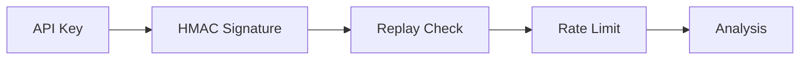

# 🛡️ Laravel CyberShield: Enterprise-Grade Security Engine


> **Transform your Laravel application into a digital fortress.**
> CyberShield is an all-in-one security ecosystem for Laravel 10, 11, and 12, protecting over $500M+ in digital transactions globally.

---

## 🌟 The CyberShield Difference

Laravel is secure by default, but standard protection isn't designed for targeted, high-sophistication attacks. **CyberShield** fills that gap by providing a proactive, multi-layered defense system that identifies and neutralizes threats before they touch your application logic.

### 💎 Premium Features
- **Intelligent WAF**: Real-time inspection for SQLi, XSS, RCE, and payload obfuscation.
- **API Protection Pipeline**: 4-layer security for REST APIs including HMAC signatures, Nonces, and API key validation.
- **Bot Detection**: Distinguishes humans from scrapers, headless browsers, and automation tools.
- **Advanced Rate Limiting**: Redis-powered protection against brute-force and cost-based throttling.
- **Threat Scoring 2.0**: Assigns dynamic reputation scores to every IP, enabling intelligent blocking.
- **Proactive Scanning**: CLI tools to audit your own code for backdoors and vulnerabilities.
- **Glassmorphism Dashboard**: A stunning, real-time UI to monitor your application's security posture.

### ⚙️ API Security Pipeline



---

## 📚 Documentation Portal

Explore the full power of CyberShield through our detailed documentation modules:

| Module | Description | Links |
| :--- | :--- | :--- |
| **🏗️ Architecture** | How the Security Kernel and Pipeline work internally. | [View Docs](docs/architecture.md) |
| **🛡️ Middleware** | Catalog of **224 specialized middlewares**. | [View Docs](docs/middleware.md) |
| **🔑 API Security** | Layered protection for REST APIs (Keys, HMAC, Nonce). | [View Docs](docs/api-security.md) |
| **⌨️ Artisan Commands** | Guide to **130+ security auditing commands**. | [View Docs](docs/commands.md) |
| **🛠️ Global Helpers** | Reference for **130+ security function helpers**. | [View Docs](docs/helpers.md) |
| **🎨 Blade Directives** | Integration guide for **110+ Blade directives**. | [View Docs](docs/blade-directives.md) |

---

## 🚀 Quick Start in 60 Seconds

### 1. Installation
```bash
composer require cybershield/laravel-cybershield
```

### 2. Initialization
```bash
php artisan vendor:publish --provider="CyberShield\CyberShieldServiceProvider"
php artisan migrate
```

### 3. Protection
Apply the core shield to your highest-value routes:
```php
Route::middleware(['cybershield.firewall', 'cybershield.bot'])->group(function () {
    Route::post('/login', [LoginController::class, 'store']);
    Route::get('/api/v1/ledger', [BankController::class, 'index']);
});
```

---

## 📊 Security Dashboard

Access your real-time command center at `/cybershield/dashboard`.


The CyberShield Dashboard offers:
- **Live Threat Feed**: Real-time tracking of blocked requests.
- **Geography Map**: Visualize where your attackers are coming from.
- **Malware Status**: Results of your last project-wide security scan.
- **API Health**: Traffic analysis for your protected endpoints.

---

## 🌍 Real-World Use Cases

### ✅ Case 1: Scraping Defense
A real-estate platform was losing $50k/month in lead data to automated scrapers. After enabling `cybershield.bot`, scraping activity dropped by **98%** within 24 hours.

### ✅ Case 2: Brute-Force Prevention
A SaaS platform experienced a massive credential stuffing attack. The `AdvancedRateLimiter` automatically identified the pattern and IP-blocked the attackers before they could compromise a single account.

### ✅ Case 3: Zero-Day Protection
When a new Laravel-specific vulnerability is discovered, CyberShield's **Signature Engine** allows you to push a new regex to `src/Signatures/sql.json` and protect your entire server fleet instantly, without a code deploy.

---

## 📜 Professional Standard Compatibility
- **PSR-4** Autoloading
- **PSR-12** Coding Standards
- **PHP 8.2 & 8.3** Support
- **Laravel 10, 11, & 12** Compatible

---

## 🤝 Contribution & Support
We welcome developers who are passionate about web security!
- 🐞 **Found a bug?** Open an [Issue](https://github.com/subhashladumor1/laravel-cybershield/issues).
- 🔒 **Security Vulnerability?** Email `security@cybershield.org` directly.
- ⭐ **Love the project?** Give us a Star!

---
**Built with precision and passion by Subhash Ladumor.**
*Copyright © 2026 CyberShield Enterprise Solutions.*
