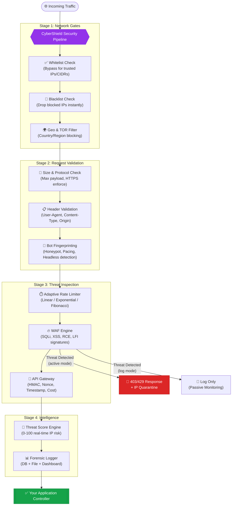

# 🛡️ Laravel CyberShield
### *Enterprise-Grade Security Intelligence for Modern Laravel Ecosystems*

<p align="center">
  <a href="https://packagist.org/packages/subhashladumor1/laravel-cybershield"></a>
  <a href="https://packagist.org/packages/subhashladumor1/laravel-cybershield"></a>
  <a href="https://packagist.org/packages/subhashladumor1/laravel-cybershield"></a>
  <a href="https://packagist.org/packages/subhashladumor1/laravel-cybershield"></a>
</p>

> [!WARNING]
> **⚠️ Beta Version** — This package is currently in **beta**. APIs, configuration keys, and middleware behaviour may change between releases. It is not yet recommended for mission-critical production environments without thorough testing.
> 
> We warmly welcome **contributors**, **bug reporters**, and **feature suggestions**! See [Contributing](#-contributing) below.

> **Laravel CyberShield** is a proactive, multi-layered security intelligence layer for Laravel applications. It combines a signature-based Web Application Firewall (WAF), adaptive rate limiting, bot fingerprinting, API integrity verification, real-time threat scoring, malware scanning, and forensic logging — all working in concert to protect your application from modern threats.

---

## 📋 Table of Contents

- [✨ Why CyberShield?](#-why-cybershield)
- [🏗️ Architecture & How It Works](#️-architecture--how-it-works)
- [🔥 Feature Overview](#-feature-overview)
- [🚀 Installation](#-installation)
- [⚙️ Configuration & .env Variables](#️-configuration--env-variables)
- [📁 Folder Structure](#-folder-structure)
- [🌍 Real-World Example: Securing a FinTech API](#-real-world-example-securing-a-fintech-api)
- [💎 Benefits](#-benefits)
- [📚 Documentation Hub](#-documentation-hub)
- [🤝 Contributing](#-contributing)
- [👥 Credits & License](#-credits--license)

---

## ✨ Why CyberShield?

Most security packages are bolt-on afterthoughts. CyberShield is designed from the ground up as a **defense-in-depth** platform that addresses the entire attack surface of a modern Laravel application.

| Feature | Basic Packages | 🛡️ CyberShield |
|---------|:---:|:---:|
| SQL Injection / XSS WAF | ✅ | ✅ |
| Adaptive Rate Limiting (Fibonacci/Exponential) | ❌ | ✅ |
| Headless Browser & Bot Fingerprinting | ❌ | ✅ |
| API HMAC Signatures + Replay Protection | ❌ | ✅ |
| Real-Time IP Threat Scoring (0-100) | ❌ | ✅ |
| Malware & Static Code Analysis | ❌ | ✅ |
| 200+ Modular Middleware Guards | ❌ | ✅ |
| 100+ Blade Security Directives | ❌ | ✅ |
| 60+ Global Security Helper Functions | ❌ | ✅ |
| Data Masking (PII, Cards, Tokens) | ❌ | ✅ |
| Geo-Blocking + TOR/VPN Detection | ❌ | ✅ |
| Network CIDR Whitelist/Blacklist | ❌ | ✅ |
| Forensic Logging & Security Dashboard | ❌ | ✅ |
| Response mode: `active` (block) or `log` (observe) | ❌ | ✅ |

---

## 🏗️ Architecture & How It Works

Every HTTP request passes through a multi-stage, sequential security pipeline before reaching your application's business logic.



### 🧠 Core Processing Principles

1. **Dual Mode Operation**: Set `CYBERSHIELD_GLOBAL_MODE=active` to block threats or `log` to silently monitor — perfect for onboarding without disruption.
2. **Dynamic Threat Scoring**: Each IP accumulates a risk score (0-100) based on behavioral signals. Scores decay over 24 hours.
3. **Signature Intelligence**: WAF rules are JSON-based and loaded dynamically — extend without touching core code.
4. **Stateless + Stateful Guards**: Fast stateless header checks run first; cache-backed stateful checks (rate limiting, bot pacing) run second.

---

## 🔥 Feature Overview

### 1. 🔥 Web Application Firewall (WAF)
Deep-packet inspection engine covering the OWASP Top 10:
- **SQL Injection**: `UNION SELECT`, `DROP TABLE`, `SLEEP()`, `EXTRACTVALUE()`
- **Cross-Site Scripting (XSS)**: `<script>`, `onerror=`, `javascript:` URIs
- **Remote Code Execution (RCE)**: `eval()`, `shell_exec()`, `system()`
- **Local File Inclusion (LFI)**: `../etc/passwd`, `C:\Windows\`
- **Path Traversal**: `../` patterns in URIs
- Payload normalization to defeat evasion attacks (e.g., `SEL/**/ECT`)

### 2. 🤖 Bot & Automation Defense
Multi-dimensional fingerprinting that goes beyond User-Agent strings:
- Honeypot hidden form fields (`@secureHoneypot`)
- Headless browser detection (Puppeteer, Playwright, Selenium)
- Behavioral pacing analysis (request-timing anomalies)
- JS environment variable markers detection
- Tool fingerprinting: cURL, Guzzle, wget, Scrapy, Postman

### 3. ⏱️ Adaptive Rate Limiting
Three strategies for smart traffic shaping:
- **Linear**: Fixed limit per window — general API usage
- **Exponential**: Delay grows 2x with each violation — login protection  
- **Fibonacci**: Follows 1, 2, 3, 5, 8... sequence — high-security endpoints
- Multi-layer throttling: per-IP, per-user, per-route, burst protection

### 4. 🔑 API Security Gateway
Enterprise-grade integrity guarantees for REST/GraphQL APIs:
- **HMAC-SHA256** request signature verification
- **Nonce** (number-used-once) replay attack prevention
- **Timestamp tolerance** validation (configurable, default 60s)
- **Resource cost budgets** per endpoint (prevent exhaustion attacks)
- **API Key registry** with per-key rate limiting tiers

### 5. 🌍 Network & Geo Intelligence
- CIDR-based whitelist/blacklist (e.g., `192.168.1.0/24`)
- Country-level blocking (ISO codes via `CF-IPCountry` / `X-Country-Code`)
- TOR exit node detection (real-time check.torproject.org feed, cached 12h)
- VPN, proxy, and datacenter IP identification
- IPv4 & IPv6 support

### 6. 🕵️ Threat Intelligence Engine
- Real-time IP risk scoring (0 = Safe, 100 = Block)
- Automatic IP quarantine on threat detection
- Dynamic block durations by severity (1 day → 30 days)
- Configurable threat score thresholds

### 7. 🔬 Project Security Audit
Artisan-powered static analysis with 11 specialized rule engines:
- Malware pattern detection in PHP files
- SQL Injection vulnerability scanning
- XSS vulnerability scanning
- Configuration security checks (debug mode, exposed keys)
- Dependency vulnerability analysis
- Model security (mass-assignment exposure)
- File upload security
- Bot detection code quality
- API security posture
- Auth security patterns
- Infrastructure configuration review

### 8. 📊 Forensic Logging & Monitoring
- Structured logging to database (`security_logs` table)
- File-based logging with rotation (daily/weekly)
- 9 log channels: request, API, bot, threat, system, traffic, database, queue, middleware
- CSV/JSON export for SIEM integration
- Security dashboard with Chart.js visualizations

---

## 🚀 Installation

### Requirements
- PHP **8.2+**
- Laravel **10.x / 11.x / 12.x**
- A configured Cache driver (Redis recommended for production)

### Step 1: Install via Composer
```bash
composer require subhashladumor1/laravel-cybershield
```

### Step 2: Publish Assets
```bash
# Publish config file, migrations, and views
php artisan vendor:publish --provider="CyberShield\CyberShieldServiceProvider"

# Or publish selectively:
php artisan vendor:publish --tag=cybershield-config
php artisan vendor:publish --tag=cybershield-migrations
php artisan vendor:publish --tag=cybershield-views
```

### Step 3: Run Migrations
```bash
php artisan migrate
```

### Step 4: Initialize CyberShield
```bash
php artisan security:base init
```

### Step 5: Register the Global Guard

**Laravel 11+ (`bootstrap/app.php`)**:
```php
use Illuminate\Foundation\Application;
use Illuminate\Foundation\Configuration\Middleware;

return Application::configure(basePath: dirname(__DIR__))
    ->withMiddleware(function (Middleware $middleware) {
        // Option A: Protect all routes globally
        $middleware->append(\CyberShield\Http\Middleware\FirewallMiddleware::class);
        
        // Option B: Register route-level aliases
        $middleware->alias([
            'cybershield.waf'     => \CyberShield\Http\Middleware\FirewallMiddleware::class,
            'cybershield.bot'     => \CyberShield\Http\Middleware\DetectBotMiddleware::class,
            'cybershield.rate'    => \CyberShield\Http\Middleware\IpRateLimiterMiddleware::class,
        ]);
    })
    ->create();
```

**Laravel 10 (`app/Http/Kernel.php`)**:
```php
protected $middleware = [
    // ... other global middleware
    \CyberShield\Http\Middleware\FirewallMiddleware::class,
];

protected $middlewareAliases = [
    // All 200+ cybershield.* aliases are auto-registered by the ServiceProvider
];
```

### Step 6: Configure `.env`
```env
CYBERSHIELD_ENABLED=true
CYBERSHIELD_GLOBAL_MODE=active
CYBERSHIELD_ENFORCE_HTTPS=true
CYBERSHIELD_BLOCK_TOR=false
CYBERSHIELD_SIGNATURE_BLOCK_THRESHOLD=medium
```

---

## ⚙️ Configuration & .env Variables

All `.env` keys map to values in `config/cybershield.php`. Below is the complete reference.

### 🔧 Core Settings

| `.env` Key | Default | Description |
|-----------|---------|-------------|
| `CYBERSHIELD_ENABLED` | `true` | Master on/off switch for the entire package. |
| `CYBERSHIELD_GLOBAL_MODE` | `active` | `active` = block threats. `log` = log only (passive/monitor). |

### 📦 Module Toggles

| `.env` Key | Default | Controls |
|-----------|---------|---------|
| `CYBERSHIELD_REQUEST_SECURITY_ENABLED` | `true` | Request structure/header validation. |
| `CYBERSHIELD_RATE_LIMITING_ENABLED` | `true` | All rate limiting strategies. |
| `CYBERSHIELD_BOT_PROTECTION_ENABLED` | `true` | Bot detection & honeypot. |
| `CYBERSHIELD_NETWORK_SECURITY_ENABLED` | `true` | IP/Geo/TOR/Proxy filtering. |
| `CYBERSHIELD_AUTH_SECURITY_ENABLED` | `true` | Session & authentication hardening. |
| `CYBERSHIELD_API_SECURITY_ENABLED` | `true` | API Gateway (HMAC, Nonce, Keys). |
| `CYBERSHIELD_THREAT_DETECTION_ENABLED` | `true` | WAF & threat scoring engine. |
| `CYBERSHIELD_MONITORING_ENABLED` | `true` | Dashboard & forensic logging. |

### 🌐 Request Security

| `.env` Key | Default | Description |
|-----------|---------|-------------|
| `CYBERSHIELD_MAX_SIZE` | `5242880` | Max request body size in bytes (5MB). |
| `CYBERSHIELD_ENFORCE_HTTPS` | `true` | Force HTTPS on all requests. |
| `CYBERSHIELD_ALLOWED_ORIGINS` | `localhost` | Comma-separated allowed CORS origins. |

### ⏱️ Rate Limiting

| `.env` Key | Default | Description |
|-----------|---------|-------------|
| `CYBERSHIELD_RATE_LIMIT_DRIVER` | `cache` | Cache driver for counters (`cache`, `redis`). |

### 🌍 Network & Geo

| `.env` Key | Default | Description |
|-----------|---------|-------------|
| `CYBERSHIELD_BLOCK_TOR` | `false` | Block all TOR exit node traffic. |

### 🔥 WAF & Signatures

| `.env` Key | Default | Description |
|-----------|---------|-------------|
| `CYBERSHIELD_SIGNATURES_PATH` | `src/Signatures` | Path to the JSON signature rules directory. |
| `CYBERSHIELD_CUSTOM_SIGNATURES_PATH` | `null` | Path to your own custom JSON signature files. |
| `CYBERSHIELD_SIGNATURE_BLOCK_THRESHOLD` | `medium` | Minimum severity to trigger a block: `low`, `medium`, `high`, `critical`. |

### 🔑 API Security

| `.env` Key | Default | Description |
|-----------|---------|-------------|
| `CYBERSHIELD_API_VERIFY_SIGNATURE` | `true` | Enable HMAC-SHA256 request signature check. |
| `CYBERSHIELD_API_REPLAY_PROTECTION` | `true` | Enable Nonce + Timestamp replay prevention. |
| `CYBERSHIELD_API_AUTO_BLOCK` | `true` | Automatically block abusive API clients. |

### 📊 Logging

| `.env` Key | Default | Description |
|-----------|---------|-------------|
| `CYBERSHIELD_LOGGING_ENABLED` | `true` | Enable/disable all security logging. |
| `CYBERSHIELD_LOG_CHANNEL` | `stack` | Laravel log channel to write security events to. |
| `CYBERSHIELD_LOG_FORMAT` | See config | Format string for log entries. |
| `CYBERSHIELD_LOG_ROTATION` | `daily` | Log rotation strategy: `daily`, `weekly`. |
| `CYBERSHIELD_LOG_MAX_SIZE` | `5242880` | Max log file size in bytes (5MB). |

### 📋 Full `.env` Template
```env
# ─── CyberShield Core ────────────────────────────────────────────────────────
CYBERSHIELD_ENABLED=true
CYBERSHIELD_GLOBAL_MODE=active                    # active | log

# ─── Module Toggles ──────────────────────────────────────────────────────────
CYBERSHIELD_REQUEST_SECURITY_ENABLED=true
CYBERSHIELD_RATE_LIMITING_ENABLED=true
CYBERSHIELD_BOT_PROTECTION_ENABLED=true
CYBERSHIELD_NETWORK_SECURITY_ENABLED=true
CYBERSHIELD_AUTH_SECURITY_ENABLED=true
CYBERSHIELD_API_SECURITY_ENABLED=true
CYBERSHIELD_THREAT_DETECTION_ENABLED=true
CYBERSHIELD_MONITORING_ENABLED=true

# ─── Request Security ────────────────────────────────────────────────────────
CYBERSHIELD_MAX_SIZE=5242880                      # 5MB in bytes
CYBERSHIELD_ENFORCE_HTTPS=true
CYBERSHIELD_ALLOWED_ORIGINS=localhost,yourdomain.com

# ─── Network & Geo ───────────────────────────────────────────────────────────
CYBERSHIELD_BLOCK_TOR=false

# ─── WAF / Signatures ────────────────────────────────────────────────────────
CYBERSHIELD_SIGNATURES_PATH=                      # leave blank for default
CYBERSHIELD_CUSTOM_SIGNATURES_PATH=               # optional: your custom rules
CYBERSHIELD_SIGNATURE_BLOCK_THRESHOLD=medium      # low | medium | high | critical

# ─── API Security ────────────────────────────────────────────────────────────
CYBERSHIELD_API_VERIFY_SIGNATURE=true
CYBERSHIELD_API_REPLAY_PROTECTION=true
CYBERSHIELD_API_AUTO_BLOCK=true

# ─── Rate Limiting ───────────────────────────────────────────────────────────
CYBERSHIELD_RATE_LIMIT_DRIVER=cache               # cache | redis

# ─── Logging ─────────────────────────────────────────────────────────────────
CYBERSHIELD_LOGGING_ENABLED=true
CYBERSHIELD_LOG_CHANNEL=stack
CYBERSHIELD_LOG_ROTATION=daily
CYBERSHIELD_LOG_MAX_SIZE=5242880
```

---

## 📁 Folder Structure

```
laravel-cybershield/
├── src/
│   ├── Blade/
│   │   └── SecurityDirectives.php       # 100+ Blade @secure* directives
│   │
│   ├── Console/
│   │   └── Commands/
│   │       ├── BaseSecurityCommand.php  # Shared UI/output helpers for commands
│   │       ├── DynamicScannerCommand.php# Dynamic behavioral scan command
│   │       ├── ListMiddlewareCommand.php# Lists all 200 registered middleware
│   │       └── SecurityScanCommand.php  # Main `security:scan` command
│   │
│   ├── Core/
│   │   ├── SecurityKernel.php           # Orchestrates the security pipeline
│   │   ├── ThreatEngine.php             # IP threat scoring & quarantine logic
│   │   └── WAFEngine.php                # Signature matching & payload inspection
│   │
│   ├── Helpers/
│   │   └── security_helpers.php         # 60+ global PHP helper functions
│   │
│   ├── Http/
│   │   └── Middleware/                  # 200+ modular middleware guards
│   │       ├── FirewallMiddleware.php    # Primary WAF entry point (global)
│   │       ├── DetectBotMiddleware.php
│   │       ├── IpRateLimiterMiddleware.php
│   │       └── ... (200+ total)
│   │
│   ├── Logging/
│   │   └── LogWriter.php                # Structured file + DB logger
│   │
│   ├── MalwareScanner/
│   │   └── MalwareScanner.php           # Static analysis for malware patterns
│   │
│   ├── Models/
│   │   └── ThreatLog.php                # Eloquent model for security_logs table
│   │
│   ├── Monitoring/
│   │   └── ...                          # Dashboard data aggregation services
│   │
│   ├── Providers/
│   │   └── CyberShieldServiceProvider.php # Service registration & boot
│   │
│   ├── RateLimiting/
│   │   └── AdvancedRateLimiter.php      # Linear/Exponential/Fibonacci engine
│   │
│   ├── Security/
│   │   ├── NetworkGuard.php             # IP/CIDR/Geo filtering
│   │   ├── DatabaseIntrusionDetector.php# DB-level injection monitoring
│   │   └── Project/
│   │       └── Rules/                   # 11 static analysis rule engines
│   │           ├── MalwareRule.php
│   │           ├── SqlInjectionRule.php
│   │           ├── XssRule.php
│   │           ├── ConfigRule.php
│   │           ├── DependencyRule.php
│   │           ├── ModelSecurityRule.php
│   │           ├── FileUploadRule.php
│   │           ├── BotDetectionRule.php
│   │           ├── ApiSecurityRule.php
│   │           ├── AuthSecurityRule.php
│   │           └── InfrastructureRule.php
│   │
│   ├── Signatures/
│   │   └── *.json                       # WAF signature rule files (SQLi, XSS, etc.)
│   │
│   ├── config/
│   │   └── cybershield.php              # Main configuration file
│   │
│   ├── resources/
│   │   └── views/                       # Blade dashboard views
│   │
│   └── routes/
│       └── web.php                      # Dashboard & API routes
│
├── docs/                                # Comprehensive documentation
│   ├── firewall.md
│   ├── bot-protection.md
│   ├── rate-limiting.md
│   ├── api-security.md
│   ├── helpers.md
│   ├── middleware.md
│   ├── blade-directives.md
│   ├── commands.md
│   └── ... (19 total docs)
│
├── composer.json
├── phpunit.xml
└── README.md
```

---

## 🌍 Real-World Example: Securing a FinTech API

This example demonstrates securing a payment processing API endpoint against the most common attack vectors.

### Scenario
A `POST /api/v1/transactions` endpoint processes financial transfers. It's a high-value target for:
- Bot-driven credential stuffing
- SQL injection to manipulate account balances
- Replay attacks to process the same transaction twice
- Resource exhaustion from heavy parallel requests

### Solution: The Full CyberShield Stack

**Step 1: Route definition with layered middleware**
```php
// routes/api.php
use CyberShield\Http\Middleware\FirewallMiddleware;

Route::middleware([
    'cybershield.block_blacklisted_ip',       // Instant drop for known-bad IPs
    'cybershield.detect_tor_network',         // Block anonymized attackers
    'cybershield.verify_api_key',             // Validate X-API-KEY header
    'cybershield.verify_api_signature',       // HMAC-SHA256 request integrity
    'cybershield.verify_api_nonce',           // Prevent replay attacks
    'cybershield.verify_api_timestamp',       // Reject requests older than 60s
    'cybershield.detect_sql_injection',       // WAF: SQLi detection
    'cybershield.api_rate_limiter',           // Adaptive throttling
    'cybershield.log_security_event',         // Forensic audit trail
])->group(function () {
    Route::post('/api/v1/transactions', [TransactionController::class, 'store']);
});
```

**Step 2: Controller using helper functions**
```php
// app/Http/Controllers/TransactionController.php
class TransactionController extends Controller
{
    public function store(Request $request): JsonResponse
    {
        // Check threat score before processing
        if (is_high_risk()) {
            block_current_ip('High risk score on financial endpoint');
            return response()->json(['error' => 'Access denied.'], 403);
        }

        // Validate payload is not malicious
        $rawPayload = $request->getContent();
        if (is_malicious_payload($rawPayload)) {
            log_threat_event('malicious_payload', ['endpoint' => 'transactions']);
            return response()->json(['error' => 'Invalid payload.'], 422);
        }

        // Verify HMAC signature from client
        $signature = $request->header('X-Signature');
        $secret = config('services.payment_gateway.secret');
        if (!verify_api_signature($rawPayload, $signature, $secret)) {
            return response()->json(['error' => 'Signature mismatch.'], 401);
        }

        // Mask PII in logs
        $logData = [
            'account'  => mask_card($request->input('card_number')),
            'email'    => mask_email($request->input('email')),
            'ip'       => mask_ip(),
        ];
        Log::info('Transaction processed', $logData);

        // Process the transaction...
        return response()->json(['status' => 'success']);
    }
}
```

**Step 3: Secure Blade UI for the dashboard**
```blade
{{-- resources/views/transactions/index.blade.php --}}

@secureAuth
    <div class="transaction-list">
        
        @secureThreatHigh
            <div class="alert alert-danger">
                ⚠️ Unusual activity detected on your account. 
                Some features have been temporarily restricted.
            </div>
        @endsecureThreatHigh

        <table>
            <tr>
                <td>Card on file:</td>
                <td>@secureMaskCard($user->card_number)</td>
            </tr>
            <tr>
                <td>Email:</td>
                <td>@secureMaskEmail($user->email)</td>
            </tr>
        </table>

        @secure2fa
            <button class="btn-primary">Make Transfer</button>
        @else
            <p class="warning">Enable 2FA to initiate transfers.</p>
        @endsecure2fa

    </div>
@else
    <p>Please log in to view transactions.</p>
@endsecureAuth

@secureHoneypot
{{ csrf_field() }}
```

**Step 4: Client-side API call (HMAC generation)**
```php
// Example: Generating a signed API request (client SDK)
$payload    = json_encode(['amount' => 100, 'to' => 'ACC-9876']);
$nonce      = bin2hex(random_bytes(16));
$timestamp  = time();
$secret     = env('API_SECRET');

// Canonical string: METHOD + URL + PAYLOAD + TIMESTAMP + NONCE
$canonical  = 'POST' . '/api/v1/transactions' . $payload . $timestamp . $nonce;
$signature  = hash_hmac('sha256', $canonical, $secret);

Http::withHeaders([
    'X-API-KEY'   => env('API_KEY'),
    'X-Signature' => $signature,
    'X-Nonce'     => $nonce,
    'X-Timestamp' => $timestamp,
    'Content-Type'=> 'application/json',
])->post('https://yourapp.com/api/v1/transactions', json_decode($payload, true));
```

**Result**: This single endpoint is now protected against SQL injection, replay attacks, bot scraping, brute force, IP flooding, and unauthorized access — with full audit logs for every interaction.

---

## 💎 Benefits

| Benefit | Detail |
|---------|--------|
| 🚀 **Near-Zero Overhead** | Middleware chain adds `<2ms` latency; stateless checks are sub-millisecond. |
| 🧩 **Plug-and-Play** | Auto-discovered via Laravel's package auto-discovery. No manual registration. |
| 🔧 **Highly Configurable** | Every behavior configurable via `.env` or `config/cybershield.php`. |
| 🔌 **Modular Architecture** | Enable/disable any of the 8 security modules independently. |
| 📊 **Observability First** | Every decision is logged. Export to CSV/JSON for SIEM tools. |
| 🛠️ **Developer-Friendly** | 60+ global helpers, 100+ Blade directives, 200+ middleware aliases. |
| 🔄 **Dual Mode** | Roll out in `log` mode first to observe without disrupting production traffic. |
| 📈 **Scalable** | Redis-backed rate limiting syncs limits across multiple application instances. |
| 🌍 **International** | Geo-blocking, country codes, and IPv4/IPv6 support built in. |
| 📋 **CI/CD Ready** | `security:scan --json` produces machine-readable output for build pipelines. |

---

## 📚 Documentation Hub

Our documentation is structured for both quick reference and deep technical dives.

### 🔥 Core Security Engines
| Document | Description |
|----------|-------------|
| [🔥 Web Application Firewall](docs/firewall.md) | Signature-based WAF, payload normalization, custom rules. |
| [🤖 Bot & Automation Defense](docs/bot-protection.md) | Honeypots, headless browser detection, behavioral pacing. |
| [⏱️ Adaptive Rate Limiting](docs/rate-limiting.md) | Linear, Exponential, Fibonacci strategies with real examples. |
| [🔑 API Security Gateway](docs/api-security.md) | HMAC, Nonce, Timestamp, Cost-based API protection. |
| [🌍 Network & Geo Intelligence](docs/networking.md) | TOR, VPN, CIDR, country-level filtering. |
| [🕵️ Threat Intelligence Engine](docs/threats.md) | Scoring logic, quarantine, and auto-block behavior. |

### 🛡️ Proactive Security
| Document | Description |
|----------|-------------|
| [🔬 Project Security Audit](docs/project-scanning.md) | Artisan-powered static analysis for your codebase. |
| [🗄️ Malware Scanner](docs/malware.md) | File-level malware pattern detection. |
| [🏗️ Architecture Deep-Dive](docs/architecture.md) | Internal component design and data flow. |

### 💻 Developer Reference
| Document | Description |
|----------|-------------|
| [🦾 Global Security Helpers](docs/helpers.md) | Complete reference for 60+ helper functions with examples. |
| [🚦 Middleware Catalog](docs/middleware.md) | All 200 middleware guards, organized by category, with usage. |
| [🎭 Blade Directives](docs/blade-directives.md) | 100+ `@secure*` directives with full code examples. |
| [⌨️ Artisan Commands](docs/commands.md) | All security scan, audit, and management commands. |
| [📝 Logging & Forensics](docs/logging.md) | Log channels, formats, rotation and export. |
| [📊 Monitoring Dashboard](docs/monitoring.md) | Real-time security metrics and visualization. |
| [⚙️ Configuration Reference](docs/configuration.md) | Complete `config/cybershield.php` explanation. |
| [📋 Signature Reference](docs/signatures.md) | Format and management of WAF signature JSON files. |

---

## 🤝 Contributing

> **This is a beta-stage open-source package — every contribution matters!**

We actively encourage the community to help shape CyberShield. Here's how you can get involved:

### 🐛 Report a Bug or Request a Feature
Open a GitHub Issue and we'll get back to you promptly:

👉 **[Open an Issue](https://github.com/subhashladumor1/laravel-cybershield/issues/new/choose)**

Please include:
- Laravel & PHP version
- Steps to reproduce
- Expected vs actual behaviour
- Any relevant logs or stack traces

### 🔧 Submit a Pull Request

1. **Fork** the repository
2. Create a feature branch: `git checkout -b feature/my-improvement`
3. Write your code and tests (PHPUnit / Pest)
4. Ensure the test suite passes: `composer test`
5. Submit a **Pull Request** against the `main` branch

👉 **[Browse open issues](https://github.com/subhashladumor1/laravel-cybershield/issues)** — look for `good first issue` or `help wanted` labels to find a great starting point.

### 📋 Contribution Guidelines
- Follow **PSR-12** coding standards
- Add or update tests for any new functionality
- Update relevant documentation in `/docs` if your change affects user-facing behaviour
- Keep PRs focused — one feature or fix per PR

### 💬 Discussions & Ideas
Have a question or a wild security feature idea? Start a conversation:

👉 **[GitHub Discussions](https://github.com/subhashladumor1/laravel-cybershield/discussions)**

---

## 👥 Credits & License

Built with extreme care for the Laravel community by **[Subhash Ladumor](https://github.com/subhashladumor1)**.

- **PHP**: 8.2+
- **Laravel**: 10, 11, 12
- **License**: [MIT](LICENSE)

*For responsible security vulnerability disclosure, please email: [security@cybershield.dev](mailto:security@cybershield.dev)*
