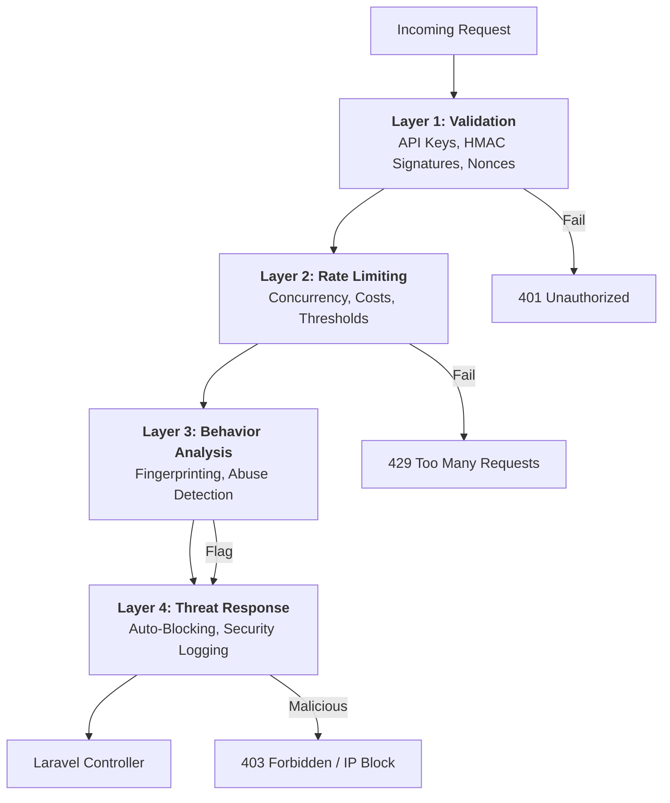

# 🔑 API Security: Multi-Layered REST Protection

CyberShield's API Security system provides an enterprise-grade protection pipeline for your RESTful services, specifically designed to neutralize automated attacks, replay attempts, and unauthorized data access.

---

## 🏗️ 4-Layer Security Pipeline

Every API request passes through a sequential, high-speed validation pipeline before reaching your controller.



---

## 💎 Core Security Features

### 1. API Key & Secret Management
Dynamic validation of API keys with support for expiration and metadata. Secrets are used to verify request integrity without ever being transmitted over the wire.

### 2. HMAC Request Signatures
Prevents data tampering by verifying a cryptographic hash of:
- HTTP Method
- Full URL
- Request Body
- X-Timestamp

### 3. Replay Attack Protection (Nonces)
Uses short-lived cryptographically unique nonces stored in Redis/Cache to ensure a specific request cannot be intercepted and re-sent by an attacker.

### 4. Cost-Based Throttling
Unlike standard rate limits, you can assign "costs" to expensive endpoints (e.g., PDF generation = 20 tokens, search = 5 tokens), preventing resource exhaustion attacks.

### 5. Concurrent Request Limiting
Prevents a single API user from opening hundreds of simultaneous connections, a common technique in Deny-of-Inventory (DoI) attacks.

---

## 🚀 Implementation Guide

### 1. Register API Keys
Create your API keys in the `api_keys` table. Minimum required fields: `key`, `secret`, `is_active`.

### 2. Apply the Middleware
Apply the `cybershield.api_security` middleware to your API routes:

```php
// routes/api.php
Route::middleware(['cybershield.api_security'])->prefix('v1')->group(function () {
    Route::get('/user', [UserController::class, 'profile']);
    Route::post('/transaction', [PayController::class, 'store']); // Protected by HMAC + Nonce
});
```

### 3. Client Header Requirements
The security engine expects the following headers from clients:
- `X-API-KEY`: The client's public identifier.
- `X-Signature`: HMAC hash of the payload.
- `X-Nonce`: Unique string for this specific request.
- `X-Timestamp`: Current unix timestamp.

---

## 🌍 Real-World Use Cases

### ✅ Use Case 1: Financial Transaction Protection
**Scenario:** A fintech app needs to ensure that "Withdraw Funds" requests aren't tampered with mid-transit.
**CyberShield Solution:** The **HMAC Signature** layer ensures that if an attacker changes the `amount` field in the body, the signature will fail, and the request is instantly blocked.

### ✅ Use Case 2: Preventing Resource Draining
**Scenario:** A generative AI API has a "Text-to-Video" endpoint that costs $0.50 in compute per call.
**CyberShield Solution:** **Cost-Based Throttling** assigns a cost of `50` to this endpoint. Once the user hits their daily budget limit, CyberShield rejects the request before it even starts the expensive GPU process.

### ✅ Use Case 3: Neutralizing Replay Attacks
**Scenario:** An attacker intercepts a valid "Unlock Door" API call from an IoT device.
**CyberShield Solution:** Since each request requires a unique **Nonce**, the attacker's attempt to "re-play" the same packet 5 minutes later is detected by the `ApiRequestValidator` and blocked as a duplicate.

---

## ⚙️ Configuration
Customize the behavior in `config/cybershield.php`:
```php
'api_security' => [
    'enabled' => true,
    'verify_signature' => true,
    'replay_protection' => true,
    'default_concurrent_limit' => 5,
    'endpoint_costs' => [
        'api/v1/heavy-report' => 50,
    ],
],
```
