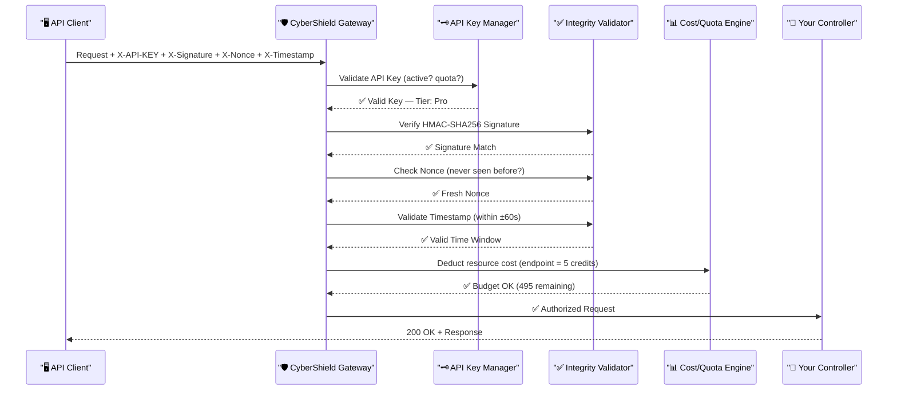

# 🔑 API Security Gateway

CyberShield provides an enterprise-ready security gateway for your REST and GraphQL APIs. It ensures every API transaction is authentic, untampered, time-bounded, and within policy — protecting against the most sophisticated API attacks.

---

## 🛡️ Core Protection Layers



---

## 1. HMAC-SHA256 Signature Verification

Every API request is signed by the client using a shared secret. CyberShield recomputes the HMAC and compares it in **constant time** to prevent timing attacks.

**What it prevents**: Man-in-the-Middle (MITM) attacks where a network interceptor modifies the request payload in transit.

### How to Sign Requests (Client-Side)
```php
// PHP Client Example
$method    = 'POST';
$url       = '/api/v1/orders';
$body      = json_encode(['item' => 'PROD-001', 'qty' => 3]);
$nonce     = bin2hex(random_bytes(16));  // Unique per request
$timestamp = time();

// 1. Create the canonical string to sign
$canonical = strtoupper($method) . $url . $body . $timestamp . $nonce;

// 2. Sign it with your API secret
$signature = hash_hmac('sha256', $canonical, $apiSecret);

// 3. Send the headers
$response = Http::withHeaders([
    'X-API-KEY'    => $apiKey,
    'X-Signature'  => $signature,
    'X-Nonce'      => $nonce,
    'X-Timestamp'  => $timestamp,
    'Content-Type' => 'application/json',
])->post("https://yourapp.com{$url}", json_decode($body, true));
```

### Server-Side Verification (Middleware)
```php
// Applied automatically by:
Route::middleware('cybershield.verify_api_signature')
    ->post('/api/v1/orders', [OrderController::class, 'store']);
```

Or verify manually in a controller:
```php
$payload   = $request->getContent();
$signature = $request->header('X-Signature');
$secret    = config('services.my_api.secret');

if (!verify_api_signature($payload, $signature, $secret)) {
    abort(401, 'Invalid signature.');
}
```

---

## 2. Replay Attack Prevention (Nonce + Timestamp)

A "replay attack" is when an attacker captures a valid, signed request and re-sends it. CyberShield uses two complementary mechanisms:

**Timestamp**: The `X-Timestamp` must be within ±60 seconds of the server's clock. Older requests are rejected.

**Nonce**: A unique value (`X-Nonce`) is stored in cache when first seen. On a second request with the same nonce, it's rejected even if the timestamp is valid.

```
Attack scenario: Attacker captures a valid $5 transfer request.

Without CyberShield:
  - Attacker replays it 100 times → $500 stolen

With CyberShield:
  - First replay: X-Timestamp is now 65 seconds old → 401 Timestamp expired
  - Even within 60s: Nonce already used → 401 Nonce already consumed
```

### Configuration
```php
'api_security' => [
    'replay_protection'   => env('CYBERSHIELD_API_REPLAY_PROTECTION', true),
    'timestamp_tolerance' => 60,  // seconds of allowed clock drift
    'headers' => [
        'nonce'     => 'X-Nonce',
        'timestamp' => 'X-Timestamp',
    ],
],
```

---

## 3. API Key Registry

Every API key is validated against the `api_keys` database table:

```sql
CREATE TABLE api_keys (
    id          bigint PRIMARY KEY,
    key         varchar(64) UNIQUE,
    secret      varchar(128),
    name        varchar(100),
    tier        enum('free', 'starter', 'pro', 'enterprise'),
    is_active   boolean DEFAULT true,
    daily_cost  int DEFAULT 0,       -- Running tally
    cost_limit  int DEFAULT 1000,    -- Daily budget
    created_at  timestamp,
    updated_at  timestamp
);
```

### Creating API Keys
```php
// In your admin panel or seeder
DB::table('api_keys')->insert([
    'key'        => secure_token(),  // 64-char hex token
    'secret'     => secure_token(),  // 64-char hex secret
    'name'       => 'Mobile App v2',
    'tier'       => 'pro',
    'cost_limit' => 50000,
    'is_active'  => true,
]);
```

---

## 4. Resource Cost Budgeting

Not all API endpoints are equal. CyberShield lets you assign a "cost" to expensive endpoints to prevent resource exhaustion:

```php
// config/cybershield.php
'api_security' => [
    'daily_cost_limit' => 10000,  // Total credits per API key per day

    'endpoint_costs' => [
        'api/v1/heavy-report'    => 100,  // Very expensive
        'api/v1/export'          => 20,   // Moderate
        'api/v1/search'          => 5,    // Light query
        'api/v1/ai/generate'     => 50,   // AI calls are expensive
        // All other routes default to 1 credit
    ],
],
```

**Example**: An API key on the `starter` plan has 1,000 credits/day:
- Can make 1,000 simple `/search` calls (5 credits × 200 = 1,000)
- OR 50 exports (20 credits × 50 = 1,000)
- OR 10 heavy reports (100 credits × 10 = 1,000)

When the budget is exhausted: `429 Too Many Requests — Daily quota exceeded`.

---

## 5. API Security Headers

| Header | Required By | Purpose |
|--------|-------------|---------|
| `X-API-KEY` | `verify_api_key` | Identifies the API client |
| `X-Signature` | `verify_api_signature` | HMAC-SHA256 payload integrity |
| `X-Nonce` | `verify_api_nonce` | Unique one-time value (16+ chars) |
| `X-Timestamp` | `verify_api_timestamp` | Unix timestamp (seconds) |
| `X-Request-ID` | `verify_api_request_id` | Distributed tracing (UUID) |
| `Content-Type` | `verify_api_header_validation` | Must be `application/json` |
| `Accept` | `verify_api_header_validation` | Must include `application/json` |

---

## 🏗️ Route Examples

### Full Protection Stack
```php
// The complete enterprise API protection layer
Route::middleware([
    'cybershield.block_blacklisted_ip',
    'cybershield.detect_tor_network',
    'cybershield.verify_api_key',
    'cybershield.verify_api_signature',
    'cybershield.verify_api_nonce',
    'cybershield.verify_api_timestamp',
    'cybershield.api_rate_limiter',
    'cybershield.verify_api_cost_limit',
    'cybershield.detect_sql_injection',
    'cybershield.log_api_usage',
    'cybershield.log_security_event',
])->prefix('api/v1')->group(function () {
    Route::post('/orders',         [OrderController::class, 'store']);
    Route::post('/payments',       [PaymentController::class, 'process']);
    Route::post('/reports/export', [ReportController::class, 'export']);
});
```

### Public Read-Only API (Lighter)
```php
Route::middleware([
    'cybershield.verify_api_key',
    'cybershield.api_rate_limiter',
    'cybershield.detect_sql_injection',
])->prefix('api/v1')->group(function () {
    Route::get('/products',  [ProductController::class, 'index']);
    Route::get('/categories',[CategoryController::class, 'index']);
});
```

---

## 🔐 Using Helper Functions in API Controllers

```php
class ApiController extends Controller
{
    public function process(Request $request): JsonResponse
    {
        // Extra manual threat check
        if (is_high_risk()) {
            log_threat_event('high_risk_api_access', ['endpoint' => request()->path()]);
            abort(403, 'Access denied: high risk client.');
        }

        // Verify signature manually (useful for webhooks with custom secrets)
        $payload = $request->getContent();
        if (!verify_api_signature($payload, $request->header('X-Sig'), $myWebhookSecret)) {
            abort(401, 'Invalid webhook signature.');
        }

        // Log sensitive access
        Log::channel('security')->info('API access', [
            'ip'       => mask_ip(),
            'key'      => mask_token($request->header('X-API-KEY')),
            'endpoint' => $request->path(),
        ]);

        // Process...
        return response()->json(['status' => 'processed']);
    }
}
```

[← Back to Rate Limiting](rate-limiting.md) | [Next: Networking →](networking.md)
