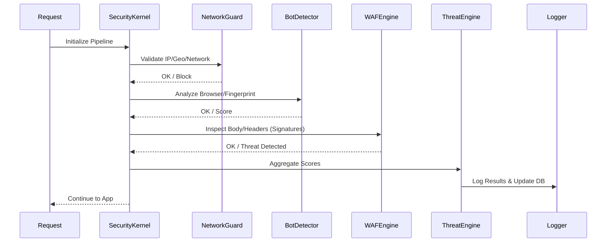

# CyberShield Architecture Deep Dive

CyberShield is built as a **Security Kernel** that sits on top of the Laravel request lifecycle. It follows a modular design where each security concern (Bot detection, Firewall, etc.) is handled by a standalone "Engine".

## The Security Kernel

The `CyberShield\Core\SecurityKernel` is the central orchestration point. It is typically invoked by the `FirewallMiddleware` and runs the request through a prioritized pipeline.

### Component Interaction Diagram

## Modular Engines

### 1. Network Guard
Handles low-level network checks:
- **Whitelisting/Blacklisting**: Fixed IPs and CIDR ranges.
- **Geo-Blocking**: Blocking based on `ISO` country codes.
- **Network Type**: Detection of TOR, VPN, and Public Proxies.

### 2. Bot Detector
Uses multiple strategies to identify non-human traffic:
- **User-Agent Analysis**: Matching against known bot patterns.
- **Honeypots**: Invisible form fields that only bots fill.
- **Fingerprinting**: Checking for headless browser markers (e.g., `X-Puppeteer-Request`).

### 3. WAF Engine (Web Application Firewall)
The firewall uses a **Signature-based Detection System**.
- **Signatures**: Stored in `src/Signatures/*.json` (e.g., `xss.json`, `sqli.json`).
- **Inspection Targets**: Body, Query, Headers, and URI.
- **Thresholds**: Alerts or blocks based on pattern severity (Low, Medium, High, Critical).

### 4. Threat Engine
Acts as the "Central Intelligence". It:
- Collects findings from other engines.
- Calculates a cumulative **Security Threat Score**.
- Automatically blacklists IPs that cross the configured threshold.

## Database Schema

CyberShield persists security events for auditing and monitoring.

- `cybershield_request_logs`: Detailed meta-data for every inspected request.
- `cybershield_ip_activity`: Tracks request velocity and frequency per IP.
- `cybershield_blocked_ips`: Permanent and temporary IP bans.
- `cybershield_threat_logs`: Detailed records of detected attacks (SQLi, XSS, etc.).
- `cybershield_system_metrics`: High-level security health stats.

---

[Next: Configuration Guide](configuration.md)
