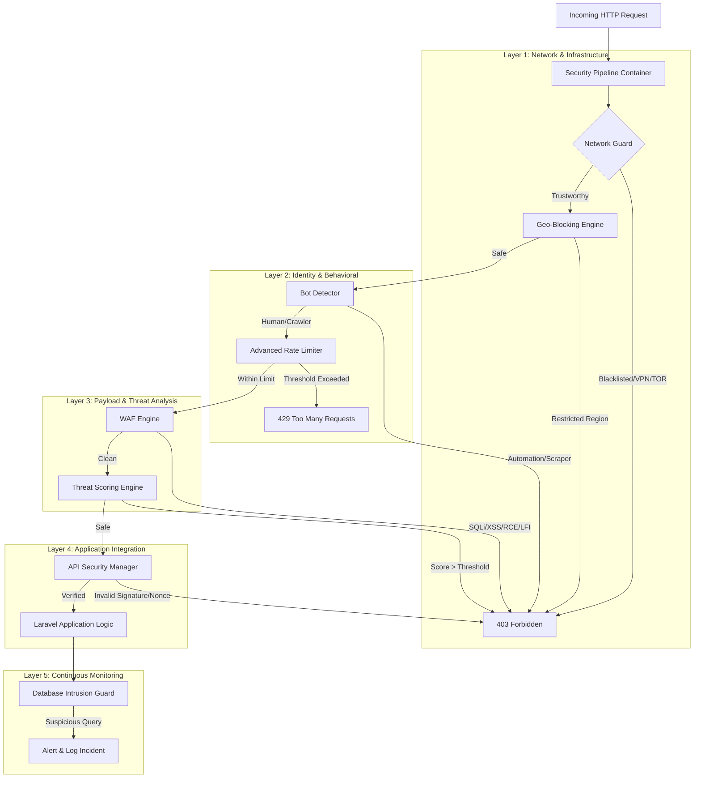

# 🏗️ Technical Architecture & Request Lifecycle

This document explains the internal mechanics of **Laravel CyberShield** and how it protects your application from the network layer down to the database.

## 🛡️ The Security Kernel

At the heart of CyberShield is the `SecurityKernel`. Unlike standard Laravel middleware that runs sequentially, the CyberShield Security Kernel operates as a **coordinated pipeline**. This ensures that high-resource inspections (like WAF) only occur after lower-resource filters (like IP blacklisting) have passed.

### 🔄 Request Flow Diagram



## 🧩 Core Components Deep-Dive

### 1. The Network Guard (`NetworkGuard.php`)
The first line of defense. It performs rapid lookups against IP blacklists, TOR exit node lists, and known VPN/Proxy ranges. 
- **Performance:** Lookups are cached in Redis to ensure sub-millisecond overhead.
- **Fail-Safe:** If the external reputation service is down, the system defaults to "Pass" but logs the event.

### 2. The WAF Engine (`WAFEngine.php`)
A sophisticated inspection layer that scans all request inputs (GET, POST, Files) and headers.
- **Matching Algorithm:** Uses fixed-order signature matching. Critically, it decodes payloads (e.g., URL encoding, Base64) before scanning to prevent obfuscation attacks.
- **Signature Database:** Signatures are stored in optimized JSON files in `src/Signatures/`.

### 3. Threat Engine & Reputation (`ThreatEngine.php`)
Instead of just "blocking" or "allowing", CyberShield maintains a **Dynamic Threat Score** for every visitor.
- **Scoring:** Small suspicious actions (e.g., missing a common browser header) add points. High-risk actions (e.g., trying to access `/etc/passwd`) immediately max out the score.
- **Persistence:** Scores are persisted in Redis with a configurable TTL (default 24 hours).

### 4. Database Intrusion Detector (`DatabaseIntrusionDetector.php`)
Even if an attacker finds a zero-day exploit that bypasses the WAF, the Database Guard provides a final safety net.
- **Logic:** It hooks into `DB::listen` to inspect the actual generated SQL. It looks for "impossible" queries or mass-extraction patterns.

## ⚙️ Configuration Integration

CyberShield is designed to be fully configurable via `config/cybershield.php`. You can enable/disable individual layers without affecting the rest of the pipeline.

```php
'modules' => [
    'firewall' => true,
    'bot_detection' => true,
    'rate_limiting' => true,
    'api_security' => true,
    'database_guard' => true,
],
```

[Go back to README.md](../README.md)
