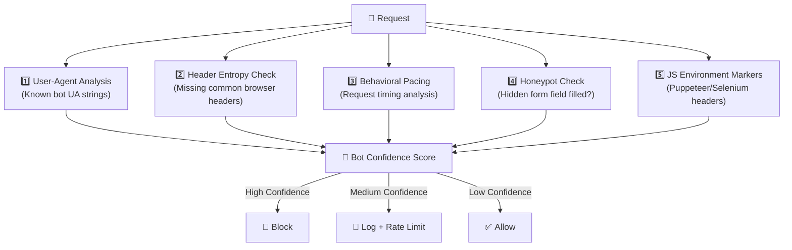
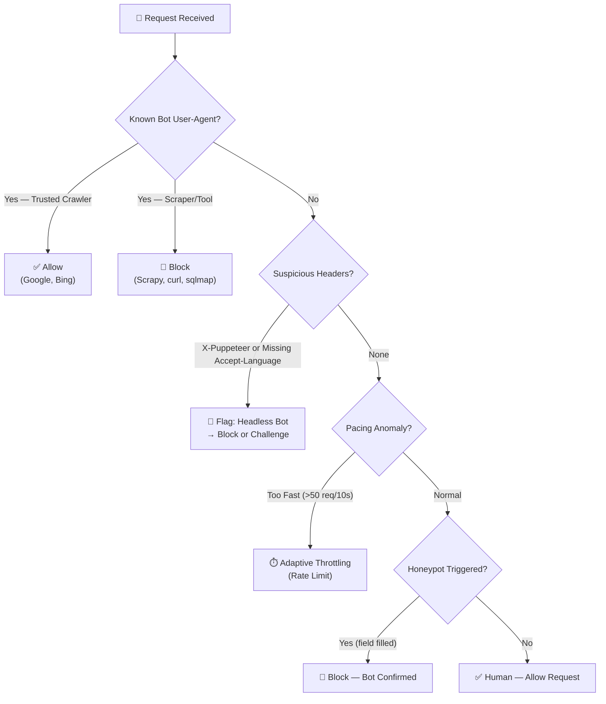

# 🤖 Bot Mitigation & Fingerprinting

Advanced automation requires advanced detection. CyberShield uses multi-dimensional fingerprinting to distinguish between valid users, search engine crawlers, and malicious scrapers — without impacting real user experience.

---

## 🔍 How It Works: The Fingerprint Matrix

CyberShield builds a **Request Fingerprint** from a combination of independent signals rather than relying on any single indicator that an attacker can easily spoof:



### Signal Details

| Signal | Method | What It Catches |
|--------|--------|----------------|
| **User-Agent Matching** | Substring match against known bot strings | cURL, Scrapy, Selenium, Guzzle, wget |
| **Header Entropy** | Checking for `Accept-Language`, `Accept-Encoding` (browsers always send) | Headless Chrome in default config |
| **Behavioral Pacing** | Request count per 10-second window (configurable) | Scrapers, brute-force bots |
| **Honeypot Trap** | Hidden form field (`hp_token_id`) | "Blind" DOM-crawling automation |
| **JS Environment Markers** | `X-Puppeteer-Request`, `X-Selenium-Driver` headers | Default Playwright/Puppeteer setups |

---

## 🍯 The Honeypot Strategy

Honeypots are one of the most reliable bot detection mechanisms because they exploit a fundamental bot behavior: form-fillers fill **all** visible fields.

### How It Works
```
Step 1: @secureHoneypot injects this into your form:
        <div style="display:none;position:absolute;left:-9999px">
          <input type="text" name="hp_token_id" value="">
        </div>

Step 2: Human user — the field is invisible. They never fill it.

Step 3: Bot crawls the DOM and fills "hp_token_id" with random data.

Step 4: cybershield.detect_bot_traffic fires the HoneypotBotMiddleware.
        If hp_token_id is not empty → instant bot flag → 403.
```

### Implementation
```blade
{{-- Add to any form that needs bot protection --}}
<form method="POST" action="/register">
    @secureHoneypot
    @secureTokenField

    <input type="text" name="name" placeholder="Your Name">
    <input type="email" name="email" placeholder="Email">
    <button type="submit">Register</button>
</form>
```

```php
// Apply the middleware to the route
Route::post('/register', [RegisterController::class, 'store'])
    ->middleware('cybershield.detect_form_submission_bot');
```

---

## 🖥️ Detecting Headless Browsers

Sophisticated scrapers like Puppeteer or Playwright leave subtle but detectable traces:

| Signal | Default in Headless | CyberShield Check |
|--------|--------------------|--------------------|
| `Accept-Language` header | Missing | `browser_common_headers` check |
| `X-Puppeteer-Request` header | Present | `suspicious_headers` check |
| User-Agent contains "HeadlessChrome" | Yes | UA substring match |
| `X-Selenium-Driver` header | Present in some setups | `suspicious_headers` check |

### Configuration
```php
// config/cybershield.php
'bot_protection' => [
    'block_headless' => true,   // Block Puppeteer/Playwright
    'block_scrapers' => true,   // Block scraping tools

    'suspicious_headers' => [
        'X-Puppeteer-Request',
        'X-Selenium-Driver',
        'X-Headless-Chrome'
    ],

    'browser_common_headers' => [
        'Accept', 'Accept-Encoding', 'Accept-Language'
    ],
],
```

---

## 📊 Decision Tree: Human vs. Bot



---

## ⚙️ Configuration Reference

```php
'bot_protection' => [
    // Master toggle
    'enabled' => env('CYBERSHIELD_BOT_PROTECTION_ENABLED', true),

    // Block ALL bots including legitimate crawlers (use carefully)
    'block_bots' => env('CYBERSHIELD_BLOCK_BOTS', false),

    // Specifically target headless browsers
    'block_headless' => true,

    // Specifically target scraping libraries
    'block_scrapers' => true,

    // Max requests per pacing window before bot flag
    'pacing_limit' => 50,   // requests

    // Pacing window duration
    'pacing_window' => 10,  // seconds

    // HTTP status code returned to detected bots
    'block_response_code' => 403,

    // Honeypot form field (add @secureHoneypot to your forms)
    'honeypot' => [
        'enabled'    => true,
        'field_name' => 'hp_token_id',
    ],

    // User-Agent strings that identify bots (case-insensitive)
    'bots' => [
        'googlebot', 'bingbot', 'slurp', 'duckduckbot', 'baiduspider', 'yandexbot',
        'curl', 'python', 'postman', 'selenium', 'headless', 'phantomjs', 'gherkin',
        'scrapy', 'wget', 'urllib', 'httpclient', 'php', 'perl', 'ruby'
    ],
],
```

---

## 🌐 Real-World Scenarios

### Scenario 1: E-Commerce Price Scraping
**Problem**: A competitor's bot scrapes your product prices every 5 minutes.
```
Bot behavior: curl/7.68.0, makes 200 requests in 60s, no cookies.

CyberShield response:
  1. cybershield.detect_scraper_bot → "curl" in UA → flagged
  2. cybershield.crawler_rate_limiter → 200 req/60s > threshold → throttled
  3. cybershield.detect_cookie_less_bot → no cookie acceptance → score +20
  → IP throttled to 1 req/10s, threat score increases
```

### Scenario 2: Account Creation Spam
**Problem**: Bots create thousands of fake accounts for spam.
```
Bot behavior: Fills all form fields (including honeypot) in 0.3s.

CyberShield response:
  1. @secureHoneypot → hp_token_id field is filled → immediate bot flag
  2. cybershield.detect_form_submission_bot → submission in < 1s → confirmed
  → 403 returned, IP logged
```

### Scenario 3: Credential Stuffing Attack
**Problem**: A bot tries 10,000 username/password combinations.
```
Bot behavior: POST /login 500 times in 60 seconds from distributed IPs.

CyberShield response:
  1. cybershield.login_rate_limiter → fibonacci backoff after 5 attempts
  2. cybershield.detect_brute_force_attack → cross-account failure pattern
  3. cybershield.detect_bot_traffic → no Accept-Language header in 40% of requests
  → IPs quarantined, global attack flag set
```

[← Back to Firewall](firewall.md) | [Next: Rate Limiting →](rate-limiting.md)
