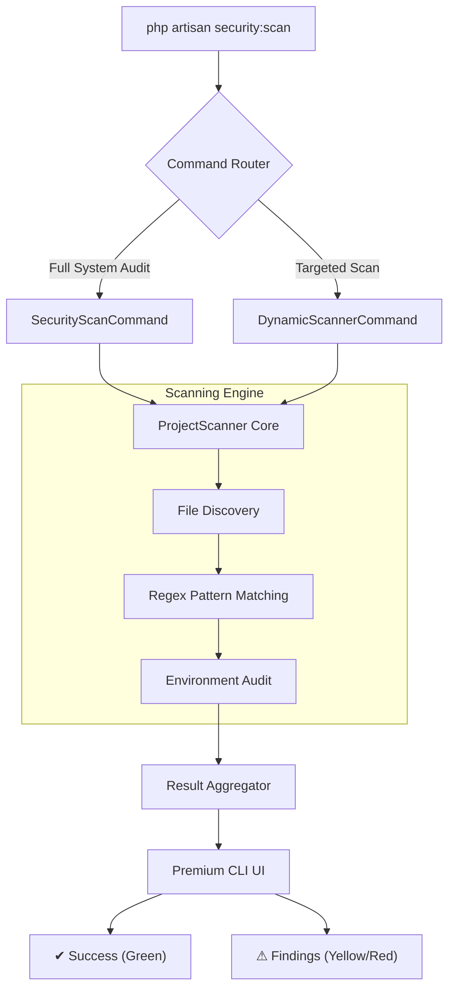

# ⌨️ CyberShield Artisan Command Suite

CyberShield transforms your standard Laravel CLI into a state-of-the-art **Security Operations Command Center**. With a specialized engine and over **130+ commands**, you have absolute visibility into your application's security posture.

---

## 🏗️ How It Works: The Security Engine

CyberShield doesn't just run static checks; it uses a multi-phase **Recursive Pattern Matching Engine** designed to think like an attacker.



### 🔍 The Scanning Lifecycle
1.  **Recursive Discovery**: The engine crawls through `app`, `routes`, `config`, `public`, and `resources` directories.
2.  **Signature Matching**: We apply a library of **130+ security signatures** (Regex) against every PHP and Blade file to detect backdoors, SQLi, and XSS.
3.  **Environment Validation**: The system checks live runtime configurations (Ports, APP_DEBUG, Key encryption) that static analysis might miss.
4.  **Premium Presentation**: Results are streamed in real-time with randomized branding and progress indicators.

---

## 🚀 The Master Command

The `security:scan` command is your primary entry point. It is context-aware and supports targeted arguments.

| command | mode | description |
| :--- | :--- | :--- |
| `php artisan security:scan` | **Full Audit** | Runs all 13 modules sequentially. Recommended before Every Release. |
| `php artisan security:scan malware` | **Malware Only** | High-speed scan for Shells, Trojans, and Obfuscated code. |
| `php artisan security:scan sql` | **SQL Injection** | Specifically audits database interaction logic. |
| `php artisan security:scan xss` | **XSS Audit** | Scans Blade templates for unescaped output vectors. |

---

## 📂 Detailed Command Catalog

CyberShield organizes its specialized scanners into **13 high-impact categories**.

### 1️⃣ Malware & Backdoors (15 Commands)
Designed to catch malicious code injected via compromised dependencies or server breaches.
- **Key Commands**: `security:scan:malware`, `security:scan:webshell`, `security:scan:backdoor`, `security:scan:eval-usage`.
- **Detection**: Identifies `eval(base64_decode())`, `shell_exec()`, and unauthorized file mutations.

### 2️⃣ Database & SQL Injection (10 Commands)
Audits your Eloquent and Query Builder usage for unsafe practices.
- **Key Commands**: `security:scan:sql`, `security:scan:raw-sql`, `security:scan:unsafe-query`.
- **Detection**: Raw SQL variable interpolation and unparameterized `whereRaw` / `selectRaw`.

### 3️⃣ XSS & Frontend Security (10 Commands)
Ensures your Blade templates and JS assets are properly sanitized.
- **Key Commands**: `security:scan:xss`, `security:scan:unsafe-blade`, `security:scan:script-injection`.
- **Detection**: Usage of `{!! !!}` with user-controlled variables and unescaped `echo`.

### 4️⃣ API Security & Exposure (10 Commands)
Scans REST/GraphQL endpoints for data leaks and auth bypasses.
- **Key Commands**: `security:scan:api`, `security:scan:api-token`, `security:scan:api-exposure`.
- **Detection**: API Token leakage, missing rate limits, and sensitive field exposure in Resources.

### 5️⃣ Authentication & Identity (10 Commands)
Verifies that your login and session logic follows modern security standards.
- **Key Commands**: `security:scan:auth`, `security:scan:2fa`, `security:scan:password`.
- **Detection**: Weak password hashing, manual login bypasses, and insecure session drivers.

### 6️⃣ Infrastructure & Config (10 Commands)
Checks if your server and environment variables are hardened for production.
- **Key Commands**: `security:scan:env`, `security:scan:debug`, `security:scan:ssl`, `security:scan:ports`.
- **Detection**: `APP_DEBUG=true` in production, missing `APP_KEY`, and insecure ports.

---

## 🛠️ Advanced Usage

### Fail-Fast CI Implementation
Integrate this into your GitHub Actions or Jenkins to prevent insecure builds:
```bash
php artisan security:scan --fail-on-issue
```

### Audit Specific Plugin Only
If you've added a new third-party package:
```bash
php artisan security:scan:malware --path=vendor/some-package/src
```

---

## 💡 Best Practices
*   **Post-Composer Audit**: Always run `security:scan:dependencies` after every `composer update`.
*   **Production Monitoring**: Schedule `security:scan --type=env` daily via the Laravel Scheduler to ensure debug modes aren't accidentally toggled.
*   **Security Reports**: Use `security:report:pdf` to generate compliance documents for stakeholders.

---

[Explore the Architecture](architecture.md) | [Back to Home](../README.md)
