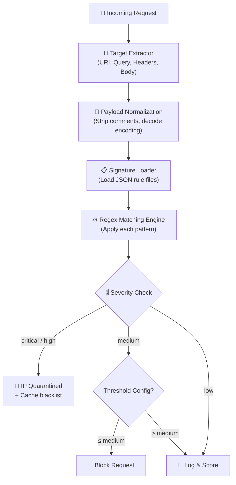
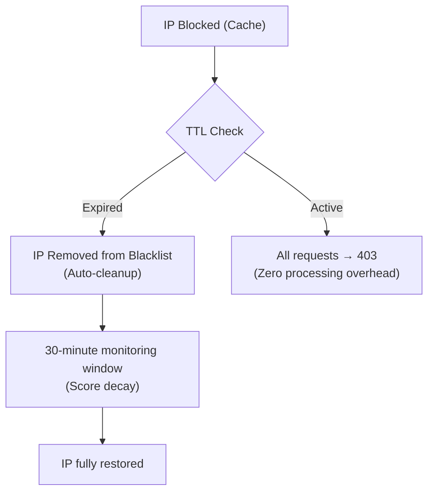

# 🔥 Web Application Firewall (WAF) & Signatures

The CyberShield WAF is a deep-packet inspection engine that protects your application from the OWASP Top 10 and beyond. It analyzes every incoming request through a normalized multi-stage pipeline before it reaches your application logic.

---

## 🧠 How It Works: The Inspection Pipeline



### Processing Steps Explained

1. **Target Extraction**: The WAF extracts content from configured targets: URI path, query string, request body (JSON/form), and HTTP headers.

2. **Payload Normalization**: Before matching, the payload is normalized to defeat evasion attacks:
   - Remove SQL comments: `SEL/**/ECT` → `SELECT`
   - Decode URL encoding: `%27` → `'`
   - Strip null bytes: `id=1%00--`
   - Normalize whitespace: `UNION  SELECT` → `UNION SELECT`

3. **Signature Matching**: Each normalized target is tested against all loaded signature patterns using PHP's `preg_match()`.

4. **Severity Scoring**: Matches are evaluated against the configured `block_threshold`. High/critical always block; lower severities can be set to log-only.

5. **IP Quarantine**: Blocked IPs are stored in the cache with a TTL based on severity. The request receives a standardized error response.

---

## 📋 Inspection Targets

Configure which parts of the request the WAF inspects in `config/cybershield.php`:

```php
'firewall' => [
    'inspection_targets' => ['query', 'body', 'headers', 'uri'],
],
```

| Target | What's Inspected | Performance Impact | Protection Level |
|--------|-----------------|-------------------|-----------------|
| `uri` | The request path: `/admin/../etc/passwd` | ⚡ Minimal | Mandatory |
| `query` | GET parameters: `?id=1 UNION SELECT *` | ⚡ Low | High |
| `headers` | `User-Agent`, `Referer`, `Accept`, etc. | ⚡ Low | Medium |
| `body` | Full POST/PUT body: JSON, form data, files | 🔥 Higher | Critical |

> [!TIP]
> Start with `['query', 'uri', 'headers']` for maximum performance. Enable `body` inspection for high-security endpoints (payment, admin, auth).

---

## 📝 Signature Intelligence

Signatures are the "brains" of the WAF. They are stored as structured JSON files in `src/Signatures/`:

### Signature File Format

```json
{
    "name": "SQL Injection Detection",
    "description": "Detects common SQL injection patterns including UNION attacks, time-based blind SQLi, and error-based extraction.",
    "category": "injection",
    "severity": "high",
    "targets": ["query", "body", "uri"],
    "patterns": [
        "union[\\s\\/*]+select",
        "drop[\\s\\/*]+table",
        "sleep\\(\\d+\\)",
        "benchmark\\(\\d+,",
        "extractvalue\\(",
        "updatexml\\(",
        "0x[0-9a-f]{4,}",
        "'[\\s]*or[\\s]*'[\\s]*=[\\s]*'",
        "insert[\\s]+into[\\s]+\\w+",
        "delete[\\s]+from[\\s]+\\w+"
    ]
}
```

### Severity Levels

| Severity | Block Threshold Behavior | Auto Block TTL |
|----------|--------------------------|---------------|
| `low` | Only blocked if threshold is `low` | 1 hour |
| `medium` | Blocked if threshold ≤ `medium` | 1 day (24h) |
| `high` | Blocked if threshold ≤ `high` | 7 days |
| `critical` | **Always blocked** regardless of threshold | 30 days |

### Built-In Signature Files

| File | Category | Patterns |
|------|----------|---------|
| `sql_injection.json` | SQLi | UNION SELECT, SLEEP, DROP TABLE, EXTRACTVALUE, time-based blind |
| `xss.json` | XSS | `<script>`, `onerror=`, `javascript:`, `eval()`, `expression()` |
| `rce.json` | RCE | `eval(`, `shell_exec(`, `system(`, `passthru(`, `exec(` |
| `lfi.json` | LFI/Path Traversal | `../`, `..\`, `/etc/passwd`, `C:\Windows` |
| `xxe.json` | XXE | `DOCTYPE ENTITY`, `SYSTEM file://`, external entity refs |
| `ssrf.json` | SSRF | Internal IP ranges in URLs, `localhost`, `169.254.169.254` |

---

## 🎛️ Configuration Reference

```php
// config/cybershield.php
'firewall' => [
    // Which parts of the request to inspect
    'inspection_targets' => ['query', 'body', 'headers', 'uri'],

    // IP block duration by severity (in days)
    'blocking_ttl' => [
        'low'      => 1,   // 1 day
        'medium'   => 3,   // 3 days
        'high'     => 7,   // 7 days
        'critical' => 30,  // 30 days + manual review flag
    ],
],

'signatures' => [
    // Default signature files location
    'path'            => env('CYBERSHIELD_SIGNATURES_PATH', base_path('src/Signatures')),
    
    // Optional: your custom signature files directory
    'custom_path'     => env('CYBERSHIELD_CUSTOM_SIGNATURES_PATH'),
    
    // Minimum severity level that triggers a block
    // 'low' | 'medium' | 'high' | 'critical'
    'block_threshold' => env('CYBERSHIELD_SIGNATURE_BLOCK_THRESHOLD', 'medium'),
],
```

---

## ➕ Adding Custom Signatures

You can extend the WAF without touching core files. Create a JSON file in your project:

**`security/firewall/custom_rules.json`:**
```json
[
    {
        "name": "Company Internal Rule: Block Competitor Scrapers",
        "category": "custom",
        "severity": "medium",
        "targets": ["headers"],
        "patterns": [
            "CompetitorBot",
            "RivalScraper/\\d"
        ]
    },
    {
        "name": "Custom: Block GraphQL Introspection",
        "category": "api_abuse",
        "severity": "low",
        "targets": ["body"],
        "patterns": [
            "__schema",
            "__type\\(",
            "IntrospectionQuery"
        ]
    }
]
```

**Point to it in `.env`:**
```env
CYBERSHIELD_CUSTOM_SIGNATURES_PATH=/var/www/myapp/security/firewall/custom_rules.json
```

---

## 🛡️ Real-World Attack Scenarios

### SQLi: UNION-Based Attack
**Attack**: `GET /search?q=1+UNION+SELECT+1,table_name,3+FROM+information_schema.tables--`

**WAF Response**:
1. Extracts query string: `q=1 UNION SELECT 1,table_name...`
2. Normalizes: removes `+`, decodes
3. Matches pattern: `union[\s\/\*]+select` → severity: `high`
4. Threshold is `medium` (≤ high) → **Block**
5. IP quarantined for 7 days
6. `log_threat_event('sql_injection', [...])` called
7. `403 Forbidden` returned to client

### XSS: Stored Script Injection
**Attack**: `POST /comments` body `content=`

**WAF Response**:
1. Inspects body (POST)
2. Normalizes HTML entities
3. Matches `onerror=` → severity: `high`
4. Blocked + logged

### RCE: PHP webshell via file upload bypass
**Attack**: File upload `shell.php.jpg` — attacker renames after upload

**WAF Response**:
- `is_php_executable()` + `scan_file_malware()` called by `FileUploadRule`
- Magic bytes checked via `get_real_mime()` — actual MIME vs reported extension
- PHP content detected → upload rejected

---

## 🔒 Quarantine & IP Block Lifecycle



### Block Duration by Severity

| Severity | Default Duration | Override in Config |
|----------|-----------------|-------------------|
| `low` | 1 day | `blocking_ttl.low` |
| `medium` | 3 days | `blocking_ttl.medium` |
| `high` | 7 days | `blocking_ttl.high` |
| `critical` | 30 days | `blocking_ttl.critical` |

### Manual IP Management
```php
// Block an IP manually for 30 days
Cache::put('cybershield:blocked:' . $ip, 'Manual block by admin', now()->addDays(30));

// Or use the helper
block_current_ip('Manually blocked by admin after incident review');

// Unblock via helper
whitelist_current_ip();

// Check if blocked
$isBlocked = ip_is_blacklisted($ip);
```

---

## ⚡ Performance Optimization

| Strategy | Details |
|----------|---------|
| **Pre-check blacklist** | Blacklisted IPs are blocked before any signature scanning |
| **Whitelist bypass** | Whitelisted IPs skip the entire WAF entirely |
| **Target filtering** | Only configured targets are extracted — no unnecessary parsing |
| **Signature caching** | Signature files are loaded once per request cycle |
| **Global mode = log** | In `log` mode, no abort() is called — minimal overhead |

> **Benchmark**: With `['query', 'uri', 'headers']` targets and 6 signature files, WAF inspection adds **~1.2ms** per request on PHP 8.2 with OPcache enabled.

[← Back to README](../README.md) | [Next: Bot Protection →](bot-protection.md)
