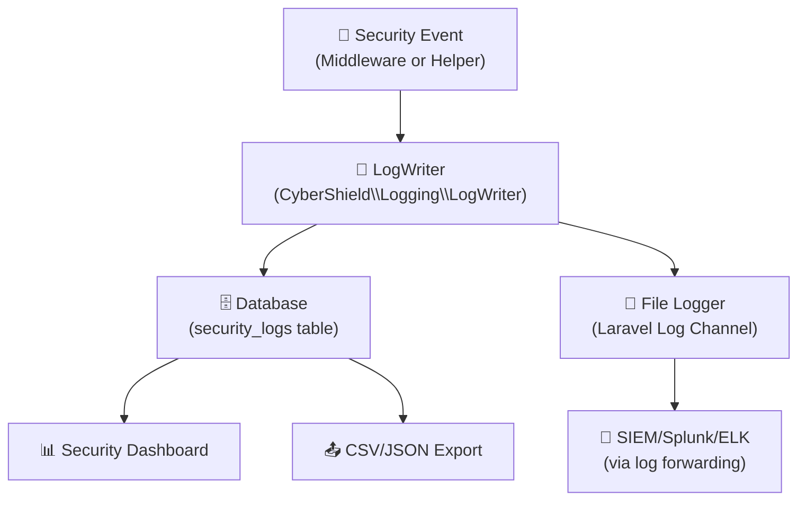

# 📝 Logging & Forensics

CyberShield provides structured, contextual forensic logging that writes simultaneously to the database and log files, with export capabilities for SIEM integration.

---

## 🏗️ Logging Architecture



---

## 📊 Log Channels

CyberShield organizes security events into 9 channels, each independently configurable:

| Channel | What It Logs | Default |
|---------|-------------|---------|
| `request` | Every HTTP request: method, URL, IP, user agent, response code | ✅ On |
| `api` | API calls: key ID, endpoint, cost, quota remaining | ✅ On |
| `bot` | Bot detection events: type detected, signals triggered | ✅ On |
| `threat` | WAF blocks: signature matched, severity, payload snippet | ✅ On |
| `system` | CyberShield lifecycle: startup, config changes, errors | ✅ On |
| `traffic` | Aggregated traffic metrics: req/s, geographic distribution | ✅ On |
| `database` | Sensitive/slow DB queries, potential injection patterns | ✅ On |
| `queue` | Background job security events, unusual job patterns | ✅ On |
| `middleware` | Individual middleware decisions (verbose for debugging) | ✅ On |

### Configuration
```php
// config/cybershield.php
'logging' => [
    'enabled' => env('CYBERSHIELD_LOGGING_ENABLED', true),

    'channels' => [
        'request'    => true,
        'api'        => true,
        'bot'        => true,
        'threat'     => true,
        'system'     => true,
        'traffic'    => true,
        'database'   => true,
        'queue'      => true,
        'middleware' => true,  // Set to false in production for performance
    ],

    // Log entry format
    // Tokens: {datetime}, {level}, {ip}, {user_id}, {method}, {url}, {status}, {message}
    'format' => '[{datetime}] {level} {ip} {user_id} {method} {url} {status} {message}',

    'rotation' => env('CYBERSHIELD_LOG_ROTATION', 'daily'),    // 'daily' | 'weekly'
    'max_size' => env('CYBERSHIELD_LOG_MAX_SIZE', 5242880),    // 5MB
],
```

---

## 🗄️ Database Logging

### The `security_logs` Table

```sql
CREATE TABLE security_logs (
    id          bigint AUTO_INCREMENT PRIMARY KEY,
    ip          varchar(45) NOT NULL,      -- Client IP address
    event_type  varchar(100) NOT NULL,     -- e.g., 'sql_injection', 'bot_detected'
    metadata    json,                      -- Context: URL, payload snippet, user agent, etc.
    user_id     bigint,                    -- NULL if not authenticated
    severity    enum('low','medium','high','critical') DEFAULT 'low',
    created_at  timestamp DEFAULT CURRENT_TIMESTAMP,
    
    INDEX idx_ip (ip),
    INDEX idx_event_type (event_type),
    INDEX idx_created_at (created_at),
    INDEX idx_severity (severity)
);
```

### Querying Security Logs

```php
use CyberShield\Models\ThreatLog;

// Recent high-severity threats
$threats = ThreatLog::where('severity', 'high')
    ->orderBy('created_at', 'desc')
    ->limit(100)
    ->get();

// All events for a specific IP in the last 24 hours
$ipEvents = ThreatLog::where('ip', $suspiciousIp)
    ->where('created_at', '>=', now()->subHours(24))
    ->get();

// Count by event type for dashboard
$summary = ThreatLog::selectRaw('event_type, COUNT(*) as count')
    ->groupBy('event_type')
    ->orderByDesc('count')
    ->get();

// Search logs for specific keywords
$sqlAttacks = ThreatLog::where('event_type', 'like', 'sql%')
    ->orWhereJsonContains('metadata->payload', 'union select')
    ->get();
```

---

## 📝 Log Format Reference

### Log Entry Structure
```
[2026-03-29 08:15:42] WARNING 203.0.113.45 user:142 POST /api/v1/orders 403 SQL injection detected

^^^^^^^^^^^^^^^^^^^^^ ^^^^^^^ ^^^^^^^^^^^^^^ ^^^^^^^^ ^^^^ ^^^^^^^^^^^^^^^^ ^^^ ^^^^^^^^^^^^^^^^^^^
      datetime         level      ip          user_id  meth   url            code    message
```

### Log File Location

By default, CyberShield writes to your configured `CYBERSHIELD_LOG_CHANNEL` (default: `stack`, which writes to `storage/logs/laravel.log`).

To write CyberShield logs to a dedicated file, add a custom channel:

```php
// config/logging.php
'channels' => [
    // ... existing channels

    'cybershield' => [
        'driver'    => 'daily',
        'path'      => storage_path('logs/cybershield.log'),
        'level'     => 'info',
        'days'      => 14,
        'formatter' => Monolog\Formatter\JsonFormatter::class,
    ],
],
```

```env
CYBERSHIELD_LOG_CHANNEL=cybershield
```

---

## 🔧 Logging with Helper Functions

### `log_threat_event(string $type, array $meta = []): void`
The primary logging function. Writes to both the Laravel log and the `security_logs` table atomically.

```php
// Basic threat log
log_threat_event('xss_attempt', [
    'payload' => $suspiciousInput,
    'url'     => request()->url(),
]);

// Detailed forensic log
log_threat_event('credential_stuffing', [
    'attempts'   => 47,
    'usernames'  => ['admin', 'root', 'john@example.com'],
    'user_agent' => get_user_agent(),
    'ip'         => real_ip(),
    'country'    => ip_country_code(),
]);
```

### Logging Middleware Usage

Apply monitoring middlewares to any route:
```php
Route::middleware([
    'cybershield.log_security_event',      // General event log
    'cybershield.log_sensitive_access',    // For PII/admin routes
    'cybershield.log_request_metadata',    // Full request details
    'cybershield.log_ip_activity',         // Track IP-to-URI map
])->group(function () {
    Route::get('/admin/users', [AdminController::class, 'users']);
});
```

---

## 📤 Export for SIEM Integration

### CSV Export via Artisan
```bash
# Export all logs from the last 7 days
php artisan security:export --format=csv --days=7 > security-$(date +%Y%m%d).csv

# Export only high-severity events
php artisan security:export --format=json --severity=high

# Export for a specific IP
php artisan security:export --format=json --ip=203.0.113.45
```

### Manual Export in Code
```php
use CyberShield\Models\ThreatLog;
use Illuminate\Support\Facades\Response;

public function exportLogs(Request $request): \Symfony\Component\HttpFoundation\StreamedResponse
{
    $logs = ThreatLog::select('ip', 'event_type', 'severity', 'metadata', 'created_at')
        ->where('created_at', '>=', now()->subDays(7))
        ->orderBy('created_at', 'desc')
        ->cursor();  // Memory-efficient streaming

    return response()->streamDownload(function() use ($logs) {
        $handle = fopen('php://output', 'w');
        fputcsv($handle, ['Timestamp', 'IP', 'Event', 'Severity', 'Details']);

        foreach ($logs as $log) {
            fputcsv($handle, [
                $log->created_at,
                mask_ip($log->ip),  // Mask for privacy
                $log->event_type,
                $log->severity,
                $log->metadata,
            ]);
        }

        fclose($handle);
    }, 'security-logs-' . date('Y-m-d') . '.csv');
}
```

---

## 📋 Sample Log Entries

### WAF Block Event
```json
{
  "datetime": "2026-03-29T08:15:42+00:00",
  "level": "WARNING",
  "ip": "203.0.113.45",
  "user_id": null,
  "method": "GET",
  "url": "/search?q=1+UNION+SELECT+*+FROM+users",
  "status": 403,
  "event_type": "sql_injection_attempt",
  "metadata": {
    "signature_file": "sql_injection.json",
    "matched_pattern": "union select",
    "severity": "high",
    "target": "query",
    "blocked": true,
    "block_ttl_days": 7
  }
}
```

### Bot Detection Event
```json
{
  "datetime": "2026-03-29T09:22:11+00:00",
  "level": "WARNING",
  "ip": "185.234.218.45",
  "user_id": null,
  "method": "POST",
  "url": "/register",
  "status": 403,
  "event_type": "bot_detected",
  "metadata": {
    "detection_method": "honeypot",
    "honeypot_field": "hp_token_id",
    "user_agent": "python-requests/2.28.0",
    "country": "RU"
  }
}
```

### Rate Limit Event
```json
{
  "datetime": "2026-03-29T10:01:05+00:00",  
  "level": "WARNING",
  "ip": "34.56.78.90",
  "user_id": 556,
  "method": "POST",
  "url": "/login",
  "status": 429,
  "event_type": "rate_limit_exceeded",
  "metadata": {
    "strategy": "fibonacci",
    "attempts": 7,
    "wait_seconds": 13,
    "window": 300
  }
}
```

[← Back to Commands](commands.md) | [Next: Monitoring Dashboard →](monitoring.md)
