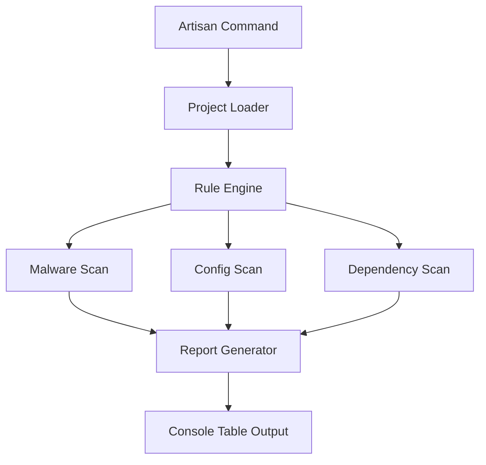

# Project & Code Auditing (Malware Scanner)

CyberShield includes a built-in static analysis engine designed to audit your entire Laravel project for security vulnerabilities and malicious code.

## Scanning Engines

### 1. Malware Scanner
Scans your project's PHP files for common obfuscation and backdoor patterns (`eval()`, `base64_decode()`, `shell_exec()`).
- **Target**: Files with `.php`, `.phtml`, `.php5` extensions.

### 2. Dependency Audit
Checks your `composer.lock` for packages with known security vulnerabilities (CVEs).

### 3. Configuration Audit
Ensures your `.env` and `config/*.php` files are following security best practices (e.g., `APP_DEBUG` is false in production).

### 4. Code Pattern Matching
Detects insecure coding practices like un-sanitized raw SQL queries or potential XSS in Blade templates.

---

## Auditing Workflow


---

## How to Run a Scan

Use the CyberShield Artisan commands to trigger a sweep.

```bash
# Full security audit
php artisan security:scan

# Scan specific directories
php artisan security:scan --path=app/Services

# Run dynamic logic scanner (Behavioral)
php artisan security:dynamic-scan
```

## Configuration

You can define which rules are active in `cybershield.php`:

```php
'project_scanner' => [
    'rules' => [
        Rules\MalwareRule::class,
        Rules\SqlInjectionRule::class,
        Rules\ConfigRule::class,
        // ...
    ],
],
```

## Real-World Benefits

### 1. Pre-Deployment Check
Add `php artisan security:scan` to your CI/CD pipeline.
- **Benefit**: Catch a junior developer accidentally using `eval()` or leaving an insecure config before it reaches production.

### 2. Post-Compromise Audit
If you suspect your server was hacked, run the Malware scanner.
- **Benefit**: Quickly find injected backdoors or web-shells hidden in deep directory structures.

[Back: Networking](networking.md) | [Next: Logging & Monitoring](logging-monitoring.md)
