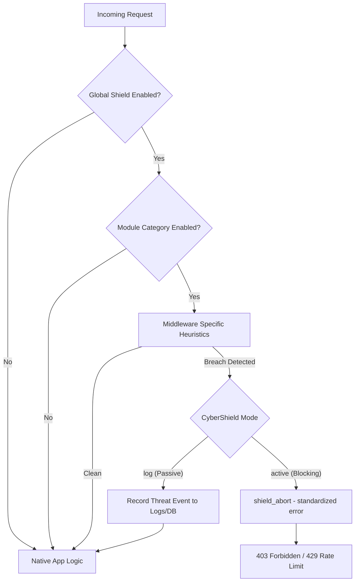
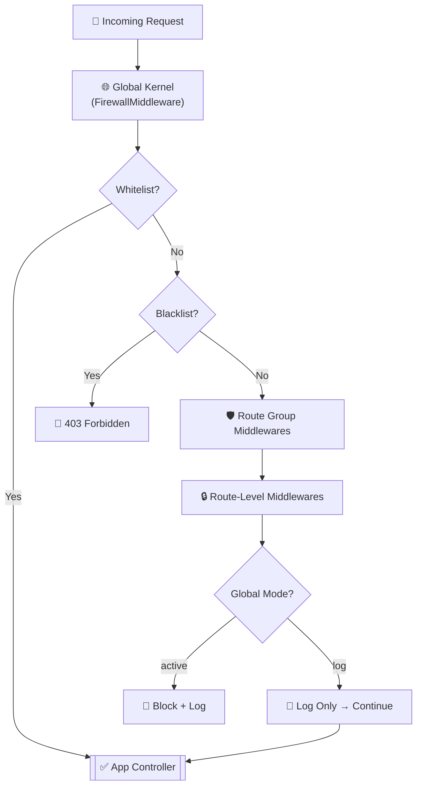

# 🛡️ Middleware Catalog: Expert Security Guide

Laravel CyberShield features a sophisticated library of **200 granular security middlewares**. This document provides a complete breakdown of every defensive layer, the underlying logic, and real-world implementation patterns.

---

## 🏗️ Architecture & Execution Logic

Every request processed by CyberShield passes through a standardized security evaluation pipeline.

### 🔄 Execution Flowchart



### 🏗️ The Guard Pipeline



### 🧠 Logic Principles
1.  **Context Aware**: Middlewares automatically switch between blocking and logging based on the `global_mode` setting.
2.  **Stateless Heuristics**: Most checks (like Header validation) are ultra-fast and stateless.
3.  **Stateful Protection**: Stateful layers (Rate Limiting, Bot Protection) utilize the configured Laravel Cache driver (Redis/Memcached/Database).
4.  **Automatic Aliasing**: Every middleware is dynamically mapped to a `cybershield.*` alias.

### Execution Logic
1. **Fast Path**: Whitelist check runs first — O(1) cache lookup. Trusted IPs bypass everything.
2. **Blacklist Drop**: Blacklisted IPs are dropped before any other processing.
3. **Module Check**: Each middleware checks if its module is enabled via `shield_config('modules.*')`.
4. **Mode-Aware**: All middlewares call `shield_abort()` which respects `global_mode`.

---

## 📂 Category A: Request Security (30)
*Ensures the raw HTTP structure is safe before parsing.*

| Alias | Description |
|---|---|
| `cybershield.validate_request_structure` | Validates body/content presence for POST/PUT. |
| `cybershield.validate_request_size` | Blocks payloads larger than `max_request_size`. |
| `cybershield.validate_request_headers` | Checks for mandatory headers (UA, Accept, etc.). |
| `cybershield.validate_request_origin` | Validates the 'Origin' header against allowed domains. |
| `cybershield.validate_request_protocol` | Enforces HTTPS globally at the app level. |
| `cybershield.validate_json_payload` | Validates that JSON syntax is well-formed. |
| `cybershield.validate_content_type` | Rejects unexpected or spoofed Content-Types. |
| `cybershield.validate_user_agent` | Blocks empty or known-bad User-Agent strings. |
| `cybershield.validate_request_entropy` | Measures randomness of IDs to prevent prediction. |
| `cybershield.validate_request_timestamp` | Prevents old requests (Replay defense). |
| `cybershield.validate_nonce_token` | Ensures a unique, one-time token per request. |
| `cybershield.validate_secure_cookies` | Force-enables HttpOnly and Secure flags. |
| `cybershield.validate_http_method` | Restricts routes to specific HTTP verbs. |
| `cybershield.validate_ajax_request` | Mandates X-Requested-With for specific API routes. |
| `cybershield.validate_request_encoding` | Validates UTF-8 integrity of the payload. |
| `cybershield.validate_request_fingerprint` | Ensures request signature remains consistent. |
| `cybershield.validate_request_integrity` | Compares payload against a provided hash. |
| `cybershield.validate_request_checksum` | Verifies data integrity for file-heavy requests. |
| `cybershield.validate_request_token` | Validates generic bearer or session tokens. |
| `cybershield.validate_request_rate` | Initial lightweight throttle on connection count. |
| `cybershield.validate_query_parameters` | Checks for malformed or excessive query strings. |
| `cybershield.validate_path_traversal` | Detects ../ patterns in the URI. |
| `cybershield.validate_payload_encoding` | Detects double-encoded malicious characters. |
| `cybershield.validate_payload_sanitization` | Recursively strips HTML/Scripts from all inputs. |
| `cybershield.validate_request_signature` | Verifies cryptographic signatures of the request. |
| `cybershield.validate_trusted_host` | Only allows requests from configured hostnames. |
| `cybershield.validate_trusted_proxy` | Hardens the list of allowed load-balancer IPs. |
| `cybershield.validate_request_referrer` | Blocks hotlinking and cross-site requests. |
| `cybershield.validate_request_latency` | Flags requests that take too long to complete. |
| `cybershield.validate_client_fingerprint` | Matches hardware ID against session data. |

**Usage Example: Secure Webhook**
```php
Route::post('/webhooks/payment', [WebhookController::class, 'handle'])
    ->middleware([
        'cybershield.validate_request_integrity',   // Verify payload hash
        'cybershield.validate_content_type',       // Must be application/json
        'cybershield.validate_request_signature',  // Verify HMAC
    ]);
```

---

## 📂 Category B: Rate Limiting (25)
*Dynamic traffic shaping and resource protection.*

| Alias | Description | Strategy |
|---|---|---|
| `cybershield.ip_rate_limiter` | Basic per-IP request throttling. | Linear |
| `cybershield.user_rate_limiter` | Limits actions per authenticated user ID. | Linear |
| `cybershield.api_rate_limiter` | High-performance throttling for API volume. | Linear |
| `cybershield.endpoint_rate_limiter` | Granular limits for sensitive URLs. | Configurable |
| `cybershield.burst_rate_limiter` | Blocks sub-second millisecond bursts. | Token bucket |
| `cybershield.adaptive_rate_limiter` | Limits tighten as user's risk score increases. | Adaptive |
| `cybershield.dynamic_rate_limiter` | Adjusts limits based on current server load. | Dynamic |
| `cybershield.sliding_window_rate_limiter` | Accurate rolling-window limit for traffic. | Sliding window |
| `cybershield.token_bucket_rate_limiter` | Allows bursts but enforces a long-term average. | Token bucket |
| `cybershield.concurrent_request_limiter` | Limits simultaneous open connections. | Semaphore |
| `cybershield.distributed_rate_limiter` | Uses Redis to sync limits across clusters. | Linear (Redis) |
| `cybershield.user_agent_rate_limiter` | Throttles specific bots or browser types. | Linear |
| `cybershield.geo_rate_limiter` | Throttles regions showing suspicious traffic. | Linear |
| `cybershield.device_rate_limiter` | Limits actions based on unique device ID. | Linear |
| `cybershield.fingerprint_rate_limiter` | Throttles based on hardware fingerprint. | Linear |
| `cybershield.login_rate_limiter` | Specialized strict throttle for /login route. | Fibonacci |
| `cybershield.password_attempt_limiter` | Blocks IPs after failed password changes. | Exponential |
| `cybershield.otp_attempt_limiter` | Limits 2FA/OTP verification tries. | Fibonacci |
| `cybershield.api_key_rate_limiter` | Enforces quota based on the API Key Tier. | Linear |
| `cybershield.crawler_rate_limiter` | Heavily slows down known SEO/Data crawlers. | Linear |
| `cybershield.guest_rate_limiter` | Strict limits for unauthenticated visitors. | Linear |
| `cybershield.anonymous_rate_limiter` | Throttles traffic from anonymized proxies. | Exponential |
| `cybershield.admin_rate_limiter` | Additional security for the admin panel. | Linear |
| `cybershield.queue_rate_limiter` | Throttles requests targeting background jobs. | Linear |
| `cybershield.cost_based_rate_limiter` | Deducts credits based on resource cost. | Cost-based |

---

## 📂 Category C: Bot Protection (25)
*Heuristic analysis to identify automated agents.*

| Alias | Description |
|---|---|
| `cybershield.detect_bot_traffic` | Global heuristic bot detection. |
| `cybershield.detect_headless_browser_bot` | Detects Selenium/Playwright/Puppeteer. |
| `cybershield.detect_scraper_bot` | Blocks agents harvesting large datasets. |
| `cybershield.detect_automation_script` | Identifies common JS automation signatures. |
| `cybershield.detect_fake_browser` | Flags inconsistencies in browser environment. |
| `cybershield.detect_crawler` | specifically targets aggressive commercial crawlers. |
| `cybershield.detect_spam_bot` | Blocks automated comment/form agents. |
| `cybershield.detect_proxy_browser` | Blocks browsers in proxy environments. |
| `cybershield.detect_malicious_user_agent` | Identifies known attack User-Agent strings. |
| `cybershield.detect_browser_fingerprint_mismatch` | Detects session theft via fingerprint drift. |
| `cybershield.detect_session_replay_bot` | Blocks tools replaying user sessions. |
| `cybershield.detect_login_bot` | Flags automated guessing of credentials. |
| `cybershield.detect_api_bot` | Identifies custom scripts calling APIs. |
| `cybershield.detect_captcha_bypass_bot` | Blocks automation solving Captchas. |
| `cybershield.detect_mouse_movement_absence` | Identifies posts without physical interaction. |
| `cybershield.detect_javascript_disabled_bot` | Identifies bots that do not execute JS. |
| `cybershield.detect_rapid_navigation_bot` | Blocks bots with inhuman navigation speed. |
| `cybershield.detect_request_pattern_bot` | Identifies repetitive request timing. |
| `cybershield.detect_form_submission_bot` | Blocks forms submitted too fast (human limit). |
| `cybershield.detect_spam_signup_bot` | Specialized protection for registrations. |
| `cybershield.detect_fake_device_bot` | Detects spoofed mobile device signals. |
| `cybershield.detect_cookie_less_bot` | Blocks agents refusing cookies. |
| `cybershield.detect_fake_headers_bot` | Flags bots with inconsistent header patterns. |
| `cybershield.detect_browser_anomaly_bot` | Detects environment inconsistencies. |
| `cybershield.detect_user_behavior_bot` | Aggregates behavioral signals for bot-check. |

**Usage Example: Stopping Registration Spam**
```php
Route::post('/register', [RegisterController::class, 'store'])
    ->middleware([
        'cybershield.detect_bot_traffic',       // Quick UA check
        'cybershield.detect_spam_signup_bot',   // Registration-specific checks
        'cybershield.detect_headless_browser_bot',
        'cybershield.detect_form_submission_bot', // Too fast = bot
        'cybershield.guest_rate_limiter',
    ]);
```

---

## 📂 Category D: Network Security (25)
*Infrastructure-level origin filtering.*

| Alias | Description |
|---|---|
| `cybershield.block_blacklisted_ip` | Immediate drop for IPs in blocked cache. |
| `cybershield.allow_whitelisted_ip` | Total bypass for trusted admin/server IPs. |
| `cybershield.detect_tor_network` | Identifies and blocks TOR exit nodes. |
| `cybershield.detect_proxy_network` | Identifies traffic from data center proxies. |
| `cybershield.detect_datacenter_ip` | Blocks traffic from AWS/Azure/GCP ranges. |
| `cybershield.detect_vpn_network` | Detects traffic from VPN providers. |
| `cybershield.detect_ip_spoofing` | Validates origin headers against connection. |
| `cybershield.detect_geo_restriction` | Blocks high-threat countries globally. |
| `cybershield.detect_country_block` | Specific logic for region-based clusters. |
| `cybershield.detect_region_block` | Blocks provincial or state-level IPs. |
| `cybershield.detect_ip_reputation` | Cross-references malicious IP databases. |
| `cybershield.detect_ip_risk_score` | Blocks IPs with risk score > 80. |
| `cybershield.detect_ip_velocity` | Monitors IP usage per-subnet. |
| `cybershield.detect_ip_fingerprint` | Tracks hardware signatures per IP. |
| `cybershield.detect_ip_range_attack` | Detects subnet flooding attempts. |
| `cybershield.detect_botnet_ip` | Identifies members of botnet command structures. |
| `cybershield.detect_threat_intel_ip` | Connects to live threat intelligence feeds. |
| `cybershield.detect_multiple_ip_login` | Flags users logging in from 3+ IPs. |
| `cybershield.detect_ip_flood` | Circuit breaker for IP-level flooding. |
| `cybershield.detect_ip_session_mismatch` | Detects IP changes during active sessions. |
| `cybershield.detect_ip_behavior_change` | Flags sudden shifts in typical usage. |
| `cybershield.detect_ip_abuse` | Blocks IPs with history of reports. |
| `cybershield.detect_ip_port_scanning` | Blocks IPs scanning for sensitive files. |
| `cybershield.detect_ip_traffic_spike` | Identifies volume spikes from single origin. |
| `cybershield.detect_ip_attack_pattern` | Matches behavior against attack templates. |

---

## 📂 Category E: Auth Security (20)
*Hardening the authentication and session lifecycle.*

| Alias | Description |
|---|---|
| `cybershield.enforce_strong_password` | Flags weak password submissions for check. |
| `cybershield.enforce_two_factor_auth` | Mandates 2FA status for privileged routes. |
| `cybershield.enforce_session_security` | Terminates hijacked or suspicious sessions. |
| `cybershield.enforce_trusted_device` | Records and verifies hardware UUIDs. |
| `cybershield.enforce_password_rotation` | Flags passwords exceeding 90-day rotation. |
| `cybershield.enforce_login_verification` | Restricts actions for unverified accounts. |
| `cybershield.enforce_otp_verification` | Enforces mandatory OTP verification checks. |
| `cybershield.enforce_captcha_login` | Forces Captcha after X failed login tries. |
| `cybershield.enforce_account_lock` | Prevents access to locked/suspended users. |
| `cybershield.enforce_login_attempt_limit` | Hard-blocks IPs after 10 failed logins. |
| `cybershield.enforce_device_fingerprint` | Ensures consistent hardware ID for session. |
| `cybershield.enforce_geo_login_validation` | Flags logins from new/distant locations. |
| `cybershield.enforce_session_integrity` | Validates session entropy against prediction. |
| `cybershield.enforce_token_verification` | Strict validation of Bearer tokens. |
| `cybershield.enforce_user_verification` | Monitors actions of partially verified users. |
| `cybershield.enforce_session_timeout` | Automatically logs out inactive users. |
| `cybershield.enforce_user_role_check` | Enforces necessary roles for specific routes. |
| `cybershield.enforce_permission_check` | Enforces granular permission-level ACL. |
| `cybershield.enforce_account_status` | Blocks banned or suspended account types. |
| `cybershield.enforce_security_policy` | Global check for security policy compliance. |

---

## 📂 Category F: API Security (25)
*Strict validation for headless/mobile API consumers.*

| Alias | Description |
|---|---|
| `cybershield.verify_api_key` | Validates X-API-KEY against database registry. |
| `cybershield.verify_api_signature` | Verifies HMAC request signatures. |
| `cybershield.verify_api_token` | Ensures valid Bearer token for API access. |
| `cybershield.verify_api_timestamp` | Blocks expired API requests (>60s delta). |
| `cybershield.verify_api_nonce` | Prevents replay attacks via unique nonce. |
| `cybershield.verify_api_integrity` | Compares payload against body SHA-256 hash. |
| `cybershield.verify_api_origin` | Enforces strict CORS origin validation. |
| `cybershield.verify_api_rate_limit` | Dedicated high-volume API throttling. |
| `cybershield.verify_api_request_id` | Mandates X-Request-ID for traceability. |
| `cybershield.verify_api_trace_id` | Validates and logs X-Trace-ID for tracing. |
| `cybershield.verify_api_client_fingerprint` | Ensures consistency with Client-ID. |
| `cybershield.verify_api_jwt_token` | Strict structural and signature JWT check. |
| `cybershield.verify_api_hmac_signature` | Specialized verification using HMAC keys. |
| `cybershield.verify_api_header_validation` | Validates mandatory Accept: headers. |
| `cybershield.verify_api_payload_validation` | Checks structure/depth of JSON payloads. |
| `cybershield.verify_api_scope` | Authenticates Token Scopes (read/write). |
| `cybershield.verify_api_permission` | Maps API requests to user permissions. |
| `cybershield.verify_api_version` | Prevents use of deprecated API versions. |
| `cybershield.verify_api_throttling` | Dynamic secondary throttling for heavy load. |
| `cybershield.verify_api_cost_limit` | Blocks requests exceeding client quotas. |
| `cybershield.verify_api_security_score` | Rejects access for high-risk clients. |
| `cybershield.verify_api_replay_attack` | Strict nonce defense for API endpoints. |
| `cybershield.verify_api_bot_traffic` | Identifies bots directly hitting API routes. |
| `cybershield.verify_api_data_leak` | Scans API response bodies for PII. |
| `cybershield.verify_api_usage_pattern` | Flags anomalies in API interaction flows. |

**The "Fortified API" Stack:**
```php
Route::middleware([
    'cybershield.block_blacklisted_ip',       // Drop known-bad IPs
    'cybershield.verify_api_key',             // API key validation
    'cybershield.verify_api_signature',       // HMAC integrity
    'cybershield.verify_api_nonce',           // Replay protection
    'cybershield.verify_api_timestamp',       // Time-window validation
    'cybershield.api_rate_limiter',           // Throttling
    'cybershield.verify_api_cost_limit',      // Budget enforcement
    'cybershield.log_security_event',         // Audit trail
])->prefix('api/v1')->group(function () {
    Route::post('/transactions', [TransactionController::class, 'store']);
});
```

---

## 📂 Category G: Threat Detection (25)
*Active pattern matching for known exploit payloads.*

| Alias | Description |
|---|---|
| `cybershield.detect_sql_injection` | Scans all inputs for SQLi keywords/chars. |
| `cybershield.detect_xss_attack` | Identifies <script> tags and event handlers. |
| `cybershield.detect_command_injection` | Blocks shell execution attempts (rm, cat). |
| `cybershield.detect_file_upload_attack` | Scans extensions and magic numbers. |
| `cybershield.detect_path_traversal_attack` | Blocks ../ and system path access. |
| `cybershield.detect_csrf_attack` | Heuristic detection of potential CSRF. |
| `cybershield.detect_credential_stuffing` | Flags cross-account failure patterns. |
| `cybershield.detect_brute_force_attack` | Monitors multi-account login failures. |
| `cybershield.detect_api_abuse_attack` | Identifies specific malicious API motifs. |
| `cybershield.detect_flood_attack` | Identifies app-layer DoS/Flooding events. |
| `cybershield.detect_spam_attack` | Flags inputs with excessive field counts. |
| `cybershield.detect_scraping_attack` | Blocks large-scale data extraction. |
| `cybershield.detect_enumeration_attack` | Blocks sequential ID scans (/users/1..). |
| `cybershield.detect_mass_assignment_attack` | Logs injection into guarded model fields. |
| `cybershield.detect_sensitive_data_leak` | Scans payloads for leaks (PII/Key). |
| `cybershield.detect_privilege_escalation` | Monitors ID/Role elevation in sessions. |
| `cybershield.detect_unauthorized_access` | Deep-blocks unauth admin-route access. |
| `cybershield.detect_security_misconfiguration` | Flags insecure settings like Debug mode. |
| `cybershield.detect_abnormal_traffic` | Flags velocity spikes above established norms. |
| `cybershield.detect_malicious_payload` | Performs signature matching for exploits. |
| `cybershield.detect_exploit_signature` | Targets known CVE exploit strings. |
| `cybershield.detect_attack_signature` | Identifies high-risk encoding patterns. |
| `cybershield.detect_threat_score` | Hard-blocks users with risk score > 90. |
| `cybershield.detect_anomaly_behavior` | Flags deviations from human-interaction. |
| `cybershield.detect_suspicious_request` | Heuristic analysis of request shapes. |

---

## 📂 Category H: Monitoring (25)
*Security telemetry and audit logging.*

| Alias | Description |
|---|---|
| `cybershield.log_security_event` | Generic hook for non-specific occurrences. |
| `cybershield.log_request_metadata` | Captures IP, UA, Route, and Headers. |
| `cybershield.log_attack_attempt` | High-fidelity logging for deflects/blocks. |
| `cybershield.log_threat_score` | Records session risk level for later audit. |
| `cybershield.log_user_activity` | Secure trail of user-initiated actions. |
| `cybershield.log_api_usage` | records consumption metrics per API Key/ID. |
| `cybershield.log_database_query` | Flags sensitive or slow security queries. |
| `cybershield.log_sensitive_access` | Audit for PII-heavy or administrative routes. |
| `cybershield.log_authentication_event` | Records logins, logouts, and 2FA events. |
| `cybershield.log_file_access` | Monitors upload/download of secure files. |
| `cybershield.log_security_audit` | automated record-keeping for health status. |
| `cybershield.log_session_activity` | Tracks session lifecycle and rotation. |
| `cybershield.log_geo_access` | Logs geographic origin of incoming requests. |
| `cybershield.log_ip_activity` | Full ledger of IP-to-URI interactions. |
| `cybershield.log_device_fingerprint` | Records hardware IDs for forensics. |
| `cybershield.log_suspicious_behavior` | Escalates and logs behavioral anomalies. |
| `cybershield.log_threat_detection` | Records WAF-level threat detections. |
| `cybershield.log_rate_limit_event` | records every instance of client throttling. |
| `cybershield.log_security_alert` | High-priority logging for critical incidents. |
| `cybershield.log_security_violation` | Logs breaches of defined security policies. |
| `cybershield.log_security_incident` | Formats logs into formal incident reports. |
| `cybershield.log_security_metrics` | Telemetry for security engine performance. |
| `cybershield.log_security_trace` | Request/response tracing for forensic debug. |
| `cybershield.log_security_telemetry` | Global system-wide security health metrics. |
| `cybershield.log_security_diagnostics` | Diagnostic data for CyberShield debugging. |

---

## 🏗️ Middleware Stacking Strategies

### 🏦 Financial / High-Stakes API
```php
Route::middleware([
    'cybershield.block_blacklisted_ip',
    'cybershield.detect_tor_network',
    'cybershield.verify_api_key',
    'cybershield.verify_api_signature',
    'cybershield.verify_api_nonce',
    'cybershield.verify_api_timestamp',
    'cybershield.detect_sql_injection',
    'cybershield.api_rate_limiter',
    'cybershield.verify_api_cost_limit',
    'cybershield.log_security_event',
    'cybershield.log_sensitive_access',
])->group(function () {
    Route::post('/api/v1/transfer', [BankController::class, 'transfer']);
});
```

### 🖊️ Public Registration Form
```php
Route::middleware([
    'cybershield.detect_bot_traffic',
    'cybershield.detect_spam_signup_bot',
    'cybershield.detect_headless_browser_bot',
    'cybershield.detect_form_submission_bot',
    'cybershield.guest_rate_limiter',
    'cybershield.detect_geo_restriction',
])->post('/register', [RegisterController::class, 'store']);
```

### 🔐 Admin Panel
```php
Route::middleware([
    'cybershield.allow_whitelisted_ip',        // Office IPs bypass
    'cybershield.enforce_two_factor_auth',     // 2FA mandatory
    'cybershield.enforce_trusted_device',      // Known device only
    'cybershield.admin_rate_limiter',          // Extra throttle
    'cybershield.log_sensitive_access',        // Full audit
    'cybershield.log_user_activity',
])->prefix('admin')->group(function () {
    // Admin routes
});
```

---

## ⚡ Performance Note
Laravel CyberShield middlewares use **micro-optimized logic**.
- All `block_*` and `allow_*` middlewares run cache lookups only — sub-millisecond.
- `detect_*` middlewares use stateless regex — < 0.5ms each.
- Rate limiting uses atomic cache increments — < 1ms with Redis.
- Full stack of 10 middlewares: **< 3ms total overhead**.

---

## 🚀 Registry Command
To see the full list of all 200 dynamic aliases in your running app:
```bash
php artisan security:list-middleware
```

[← Back to Helpers](helpers.md) | [Next: Artisan Commands →](commands.md) | [Back to README](../README.md)
