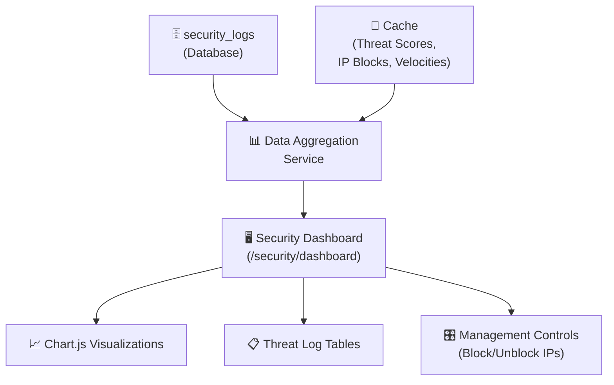

# 📊 Monitoring Dashboard & Observability

CyberShield's monitoring system provides real-time visibility into your application's security posture through a built-in Blade-based dashboard with Chart.js visualizations.

---

## 🏗️ Dashboard Architecture



---

## 🌐 Dashboard Access

The dashboard is available at the route registered by CyberShield:

```
GET /security/dashboard
```

> [!IMPORTANT]
> Protect this route! Add the appropriate middleware to restrict access to admins only.

```php
// In your RouteServiceProvider or routes/web.php
Route::middleware(['auth', 'cybershield.enforce_two_factor_auth', 'cybershield.secureAdmin'])
    ->get('/security/dashboard', function () {
        return view('cybershield::dashboard');
    });
```

---

## 📈 Dashboard Sections

### 1️⃣ Security Health Cards

Real-time status cards showing key security metrics:

| Card | Metric | Source |
|------|--------|--------|
| Total Threats (24h) | Count of threat events in last 24h | `security_logs` table |
| Active Blocks | IPs currently in blacklist | Cache keys `cybershield:blocked:*` |
| High-Risk IPs | IPs with score ≥ 75 | Cache keys `cybershield:threat_score:*` |
| Bot Requests (24h) | Bot detection events | `security_logs` where event_type LIKE 'bot%' |
| Rate Limit Events | Throttle events | `security_logs` where event_type LIKE 'rate%' |
| WAF Blocks | WAF-triggered blocks | `security_logs` where event_type LIKE 'sql%' OR 'xss%' |

### 2️⃣ Threat Distribution Chart (Donut)
Shows breakdown of threat types over the selected time period:
- SQL Injection Attempts
- XSS Attacks
- Bot Traffic
- Rate Limit Violations
- Geo/Network Blocks
- Other

### 3️⃣ Traffic Volume Timeline (Line Chart)
Requests per hour over the last 24 hours — normal traffic vs. flagged traffic side by side.

### 4️⃣ Top Attacking IPs Table
```
Rank | IP Address | Country | Threat Score | Total Events | Last Seen    | Status
-----|-----------|---------|-------------|--------------|--------------|--------
1    | 185.220.x | 🇷🇺 RU   | 98          | 342          | 2 mins ago   | 🔴 Blocked
2    | 45.33.x.x | 🇺🇸 US   | 82          | 187          | 15 mins ago  | 🔴 Blocked
3    | 91.108.x  | 🇩🇪 DE   | 67          | 94           | 1 hour ago   | 🟡 Monitored
```

### 5️⃣ Recent Security Events Feed
Live-updating list of the most recent security events with:
- Timestamp
- Event type and severity badge
- IP address (masked: `203.0.***.***`)
- Affected URL
- Action taken (Blocked/Logged)

---

## 🔧 Dashboard Programmatic API

Access dashboard data in your own controllers:

```php
use CyberShield\Models\ThreatLog;
use Illuminate\Support\Facades\Cache;

class SecurityDashboardController extends Controller
{
    public function index(): \Illuminate\View\View
    {
        // Aggregate metrics
        $data = [
            // Threat counts by period
            'threats_today'   => ThreatLog::where('created_at', '>=', now()->startOfDay())->count(),
            'threats_week'    => ThreatLog::where('created_at', '>=', now()->subWeek())->count(),
            'threats_month'   => ThreatLog::where('created_at', '>=', now()->subMonth())->count(),

            // By severity
            'critical_events' => ThreatLog::where('severity', 'critical')
                ->where('created_at', '>=', now()->subDay())->count(),
            'high_events'     => ThreatLog::where('severity', 'high')
                ->where('created_at', '>=', now()->subDay())->count(),

            // Top event types
            'top_threats' => ThreatLog::selectRaw('event_type, COUNT(*) as count')
                ->where('created_at', '>=', now()->subDay())
                ->groupBy('event_type')
                ->orderByDesc('count')
                ->limit(10)
                ->get(),

            // Top attacking IPs
            'top_ips' => ThreatLog::selectRaw('ip, COUNT(*) as attacks')
                ->where('created_at', '>=', now()->subDay())
                ->groupBy('ip')
                ->orderByDesc('attacks')
                ->limit(20)
                ->get()
                ->map(function($row) {
                    return [
                        'ip'         => mask_ip($row->ip),      // Mask for privacy
                        'attacks'    => $row->attacks,
                        'score'      => ip_threat_score($row->ip),
                        'reputation' => ip_reputation($row->ip),
                        'blocked'    => ip_is_blacklisted($row->ip),
                        'country'    => 'N/A', // Resolve via geo service
                    ];
                }),

            // Hourly traffic chart data (last 24 hours)
            'hourly_traffic' => ThreatLog::selectRaw('HOUR(created_at) as hour, COUNT(*) as count')
                ->where('created_at', '>=', now()->subDay())
                ->groupBy('hour')
                ->orderBy('hour')
                ->pluck('count', 'hour'),

            // Global attack mode status
            'under_attack'    => is_threat_active(),
            'total_blocked'   => collect(Cache::getMultiple(
                // Count active blocks (implementation varies by cache driver)
                []
            ))->count(),
        ];

        return view('security.dashboard', $data);
    }

    public function blockIp(Request $request): \Illuminate\Http\JsonResponse
    {
        $ip = $request->input('ip');
        $reason = $request->input('reason', 'Manually blocked by admin');
        $days = $request->input('days', 7);

        Cache::put("cybershield:blocked:{$ip}", $reason, now()->addDays($days));

        log_threat_event('manual_block_by_admin', [
            'ip'         => $ip,
            'reason'     => $reason,
            'admin_user' => auth()->id(),
            'days'       => $days,
        ]);

        return response()->json(['status' => 'blocked', 'ip' => mask_ip($ip)]);
    }

    public function unblockIp(Request $request): \Illuminate\Http\JsonResponse
    {
        $ip = $request->input('ip');
        Cache::forget("cybershield:blocked:{$ip}");

        log_threat_event('manual_unblock_by_admin', [
            'ip'         => $ip,
            'admin_user' => auth()->id(),
        ]);

        return response()->json(['status' => 'unblocked', 'ip' => mask_ip($ip)]);
    }
}
```

---

## 📤 Monitoring Middleware Configuration

```php
// config/cybershield.php
'monitoring' => [
    // Laravel log channel for security events
    'log_channel' => env('CYBERSHIELD_LOG_CHANNEL', 'stack'),

    // Write to database (security_logs table)
    'db_logging' => true,

    // Paths to skip from monitoring (regex patterns)
    'exclude_paths' => [
        '/_debugbar*',    // Laravel DebugBar
        '/horizon*',      // Laravel Horizon
        '/telescope*',    // Laravel Telescope
        '/favicon.ico',
    ],
],
```

---

## 🚨 Alert Integration

### Slack Notification on Critical Events
```php
// In AppServiceProvider or EventServiceProvider

use CyberShield\Models\ThreatLog;
use Illuminate\Support\Facades\Notification;

ThreatLog::created(function (ThreatLog $log) {
    if ($log->severity === 'critical') {
        Notification::route('slack', config('services.slack.security_webhook'))
            ->notify(new CriticalSecurityAlert($log));
    }
});
```

### Email Digest for Daily Reports
```php
// routes/console.php (Laravel 11+)
Schedule::call(function () {
    $yesterday = now()->subDay();
    $summary = ThreatLog::where('created_at', '>=', $yesterday)
        ->selectRaw('severity, COUNT(*) as count')
        ->groupBy('severity')
        ->get();

    if ($summary->sum('count') > 0) {
        Mail::to('security@yourcompany.com')
            ->send(new SecurityDailySummary($summary));
    }
})->dailyAt('07:00');
```

---

## 📊 Key Metrics to Monitor

| Metric | Warning Threshold | Critical Threshold | Action |
|--------|------------------|-------------------|--------|
| Threat events / hour | > 100 | > 500 | Review top IPs, enable manual block |
| Active blocked IPs | > 50 | > 200 | Investigate attack source |
| WAF blocks / minute | > 10 | > 50 | Consider emergency mode |
| Login failures / min | > 20 | > 100 | Enable CAPTCHA system-wide |
| Rate limit violations | > 200/hr | > 1000/hr | Tighten limits |
| Average threat score (top 10 IPs) | > 60 | > 85 | System-wide alert |

---

## 🔍 Using Blade Directives in the Dashboard

```blade
{{-- resources/views/security/dashboard.blade.php --}}

@secureAdmin
    <div class="security-dashboard">
        <h1>🛡️ Security Dashboard</h1>

        @secureAttackDetected
            <div class="alert-critical">
                🚨 ACTIVE ATTACK DETECTED
                <button onclick="clearAttackMode()">Clear Alert</button>
            </div>
        @endsecureAttackDetected

        @secureDebugMode
            <div class="debug-banner">
                ⚠️ APP_DEBUG is ON — disable before production use!
            </div>
        @endsecureDebugMode

        <div class="metric-cards">
            <div class="card">
                <span class="value">{{ $threats_today }}</span>
                <span class="label">Threats Today</span>
            </div>
            <div class="card @secureAttackDetected danger @endsecureAttackDetected">
                <span class="value">{{ $critical_events }}</span>
                <span class="label">Critical Events</span>
            </div>
        </div>

        <table class="threats-table">
            @foreach($top_ips as $ipData)
                <tr class="{{ $ipData['blocked'] ? 'row-blocked' : 'row-active' }}">
                    <td>{{ $ipData['ip'] }}</td>
                    <td>{{ $ipData['attacks'] }}</td>
                    <td>
                        <span class="badge-{{ strtolower($ipData['reputation']) }}">
                            {{ $ipData['reputation'] }}
                        </span>
                    </td>
                    <td>{{ $ipData['score'] }}/100</td>
                    <td>
                        @if(!$ipData['blocked'])
                            <button onclick="blockIp('{{ $ipData['ip'] }}')">Block</button>
                        @else
                            <button onclick="unblockIp('{{ $ipData['ip'] }}')">Unblock</button>
                        @endif
                    </td>
                </tr>
            @endforeach
        </table>
    </div>
@else
    <p>Access denied.</p>
@endsecureAdmin
```

[← Back to Logging](logging.md) | [← Back to README](../README.md)
