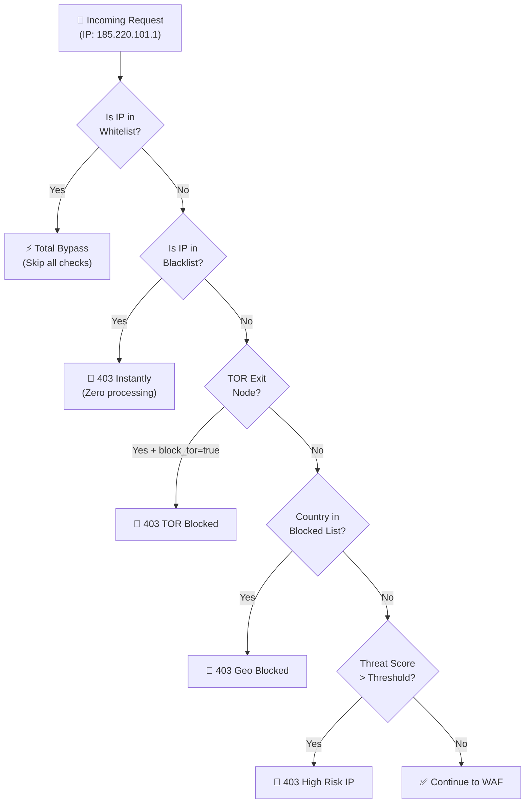

# 🌍 Network & Geo Intelligence

CyberShield provides comprehensive infrastructure-level origin filtering — blocking threats before a single line of your application code is executed.

---

## Network Guard Architecture



---

## CIDR-Based Whitelist & Blacklist

CyberShield supports both exact IP addresses and CIDR notation for all IP lists.

```php
// config/cybershield.php

// These IPs/ranges ALWAYS bypass ALL security checks
'whitelist' => [
    '127.0.0.1',         // Localhost
    '::1',               // IPv6 localhost
    '10.0.0.0/8',        // Internal network
    '172.16.0.0/12',     // Private network
    '192.168.0.0/16',    // Private network
    '203.0.113.5',       // Office public IP (exact)
    '198.51.100.0/24',   // Partner CDN subnet
],

// These IPs/ranges are ALWAYS blocked (before any other processing)
'blacklist' => [
    '185.220.101.0/24',  // Known TOR subnet
    '45.33.32.156',      // Specific blocked IP
],
```

### Dynamic Whitelist/Blacklist Management

```php
// Block an IP immediately for 7 days
Cache::put('cybershield:blocked:' . $ip, 'Reason: Abuse detected', now()->addDays(7));

// Or use the helper (blocks current request's IP)
block_current_ip('Detected via manual security review');

// Check status
$isBlocked = ip_is_blacklisted('123.45.67.89');   // true/false
$isTrusted  = ip_is_whitelisted('10.0.0.100');    // true/false (checks CIDR)

// Remove from block (whitelist)
whitelist_current_ip();
Cache::forget('cybershield:blocked:' . $ip);
```

---

## TOR Exit Node Detection

TOR provides anonymity, which is valuable for privacy-conscious users but also widely used to evade security controls. CyberShield checks against the official TOR exit node list.

### How It Works
1. On first check, CyberShield fetches the TOR exit address list from `check.torproject.org`
2. The result is cached for 12 hours (43,200 seconds) — avoids repeated external requests
3. Subsequent checks are instant cache lookups

### Configuration
```php
// .env
CYBERSHIELD_BLOCK_TOR=true  // or false (log only if in 'log' mode)
```

```php
// config/cybershield.php
'network_security' => [
    'block_tor' => env('CYBERSHIELD_BLOCK_TOR', false),
    'messages' => [
        'tor_blocked' => 'Access via TOR network is not allowed.',
    ],
],
```

### Using the Helper
```php
// Check in a controller
if (is_tor_ip()) {
    log_threat_event('tor_access', ['url' => request()->url()]);
    if (config('cybershield.network_security.block_tor')) {
        abort(403, 'TOR access is restricted.');
    }
}

// Check a specific IP
if (is_tor_ip('185.220.101.1')) {
    // This is a TOR exit node
}
```

---

## Geographic Blocking

CyberShield uses the `CF-IPCountry` header (Cloudflare) or `X-Country-Code` (custom CDN/proxy) for geo-intelligence — no external API calls, no latency.

### Block by Country (Blacklist)
```php
// config/cybershield.php
'network_security' => [
    'blocked_countries' => ['KP', 'IR', 'CU'],  // ISO 3166-1 alpha-2 codes
    'messages' => [
        'geo_blocked' => 'Access denied from your location ({country}).',
    ],
],
```

### Block by Region (Sub-national)
```php
'network_security' => [
    'blocked_regions' => ['Crimea', 'Donetsk'],  // From X-Region CDN header
],
```

### In-Code Geo Checks
```php
// Country-specific logic
$country = ip_country_code();

if (in_array($country, ['CN', 'RU'])) {
    // Restricted region — require additional verification
    return redirect()->route('geo.restricted');
}

// Show country-specific content
if ($country === 'DE') {
    // Show GDPR-specific consent dialog
    return view('gdpr.consent');
}

// Different pricing tiers by region
$currency = match($country) {
    'US', 'CA' => 'USD',
    'GB'        => 'GBP',
    'DE', 'FR', 'IT', 'ES' => 'EUR',
    'IN'        => 'INR',
    default     => 'USD',
};
```

### Blade Directive for Geo Content
```blade
@secureCountry('US')
    <div class="us-promo">🇺🇸 US users get free shipping!</div>
@endsecureCountry

@secureCountry('IN')
    <div class="in-promo">🇮🇳 INR pricing: ₹999/month</div>
@endsecureCountry
```

---

## VPN & Proxy Detection

### VPN Detection (`is_vpn_ip()`)
Checks for VPN markers in the User-Agent string:
- Keywords: `proxy`, `vpn`, `tunnel`, `tor`, `relay`, `anon`

```php
if (is_vpn_ip()) {
    // Require additional verification for VPN users
    if (config('cybershield.network_security.block_tor')) {
        abort(403, 'VPN access is restricted.');
    }
    log_threat_event('vpn_detected');
}
```

### Proxy Detection (`is_proxy_ip()`)
Checks for proxy-specific HTTP headers:
- `Via`, `X-Forwarded-For`, `X-Proxy-ID`, `Forwarded`, `X-Forwarded-Host`

```php
if (is_proxy_ip()) {
    // Additional checks for proxy users
    if (ip_threat_score() > 50) {
        abort(403, 'High-risk proxy detected.');
    }
}
```

### Datacenter IP Detection (`is_datacenter_ip()`)
Identifies requests from cloud/hosting providers (bots rarely use residential IPs):
- Detects: AWS, Amazon, Google, Azure, DigitalOcean, Vultr, Linode, OVH, Hetzner

```php
if (is_datacenter_ip() && !auth()->check()) {
    // Unauthenticated request from a datacenter — likely a bot
    log_threat_event('datacenter_ip');
}
```

---

## IP Threat Scoring

Every IP accumulates a dynamic threat score (0-100) based on events. The score decays after 24 hours.

| Event | Points Added |
|-------|-------------|
| Missing `Accept-Language` header | +20 |
| Suspicious User-Agent | +30 |
| Insecure request (no HTTPS) | +10 |
| Rate limit violation | +15 |
| WAF signature match (low) | +20 |
| WAF signature match (medium) | +35 |
| WAF signature match (high) | +60 |

### Score → Reputation Labels

| Score Range | Label | `ip_reputation()` |
|------------|-------|-------------------|
| 0 – 14 | Safe / Trusted | `"Trusted"` |
| 15 – 44 | Normal | `"Neutral"` |
| 45 – 74 | Suspicious | `"Suspicious"` |
| 75+ | Dangerous | `"Malicious"` |

### Configuration
```php
'network_security' => [
    // Auto-block IPs exceeding this score
    'threat_score_threshold' => 80,
],

'threat_detection' => [
    'score_ttl' => 86400, // Score expires in 24 hours

    'scoring' => [
        'insecure_request'        => 10,
        'missing_accept_language' => 20,
        'suspicious_user_agent'   => 30,
    ],
],
```

---

## IPv4 & IPv6 Support

CyberShield handles both address families natively:

```php
is_ipv4('203.0.113.45');       // true
is_ipv6('2001:db8::1');        // true
is_private_ip('192.168.0.1'); // true — RFC1918 private range
is_private_ip('8.8.8.8');     // false — public IP

mask_ip('203.0.113.45');       // "203.0.***.***"
mask_ip('2001:db8::1234');     // "2001:db8:::****"

check_ip_range('10.0.0.50', '10.0.0.0/8');     // true — CIDR match
check_ip_range('192.168.1.5', '192.168.1.5');  // true — exact match
```

---

## Complete `.env` Network Settings Reference

```env
# Master block for TOR exit nodes
CYBERSHIELD_BLOCK_TOR=false          # Set to true for financial/healthcare apps

# Force HTTPS
CYBERSHIELD_ENFORCE_HTTPS=true

# Max request size (5MB)  
CYBERSHIELD_MAX_SIZE=5242880

# Allowed CORS origins (comma-separated)
CYBERSHIELD_ALLOWED_ORIGINS=yourapp.com,api.yourapp.com,staging.yourapp.com
```

Add to config for runtime edits (no `.env` key needed — set directly in config):
```php
// Block specific countries at runtime
'network_security' => [
    'blocked_countries' => ['KP', 'IR'],
    'blocked_regions'   => [],
    'threat_score_threshold' => 80,
],
```

[← Back to API Security](api-security.md) | [Next: Threat Intelligence →](threats.md)
