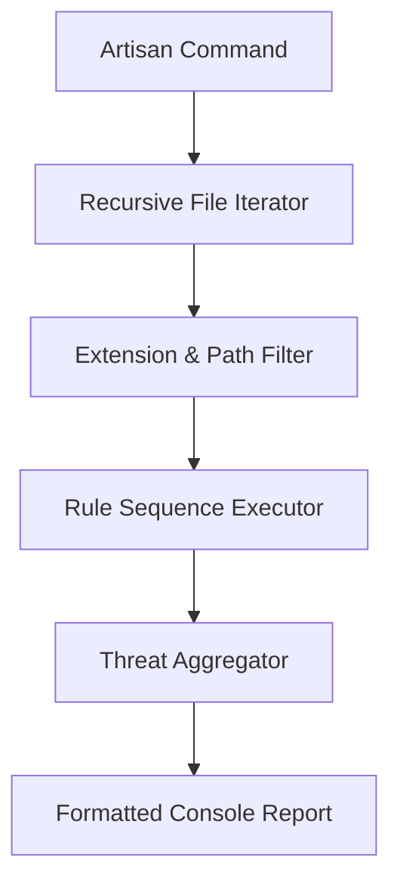

# 🔍 Project Scanning & Rule Intelligence

`security:scan` is not a simple grep tool. It is powered by a **Logical Rule Engine** that understands the context of PHP, JSON, and Laravel configuration files.

## 1. The Auditing Lifecycle
When the scanner starts, it follows a structured pipeline to ensure no file is missed and no false-positive is ignored.



---

## 2. Core Rule Deep-Dive

### Malware & Backdoor Detection (`MalwareRule`)
Scans for decentralized web-shells, obfuscated code patterns using `str_rot13`, `base64_decode`, and unconventional uses of `eval()` or `create_function()`.

### Mass-Assignment Audit (`ModelSecurityRule`)
Specifically targets Eloquent models where `$guarded = []` or `$fillable = ['*']` is used, preventing potential database hijacking.

### Infrastructure & php.ini Risks (`InfrastructureRule`)
Identifies dangerous settings like `allow_url_fopen`, `short_open_tag`, or hardcoded port numbers in your configurations.

---

## 3. Extending CyberShield: Writing Custom Rules
You can create project-specific security policies by extending the `AbstractFileScannerRule`.

### Example: Enforcing Encryption Policy
```php
namespace App\Security\Rules;

use CyberShield\Security\Project\Rules\AbstractFileScannerRule;

class EncryptionPolicyRule extends AbstractFileScannerRule {
    public function getName(): string { return 'Encryption Policy'; }

    public function scan(?string $basePath = null): array {
        $patterns = [
            'mcrypt_' => 'Legacy mcrypt detected - convert to OpenSSL/AES',
            'md5\(' => 'Insecure MD5 hashing detected for potential PII',
        ];
        return $this->scanFiles($patterns, ['app/Services']);
    }
}
```

---

## 💡 Pro-Tip: The "Audit Trail"
Always output your scans to a file for compliance audits:
```bash
php artisan security:scan --no-ansi > security-audit-$(date +%F).txt
```

[Back to Logging](logging.md) | [Go to Monitoring Dashboards](monitoring.md)
