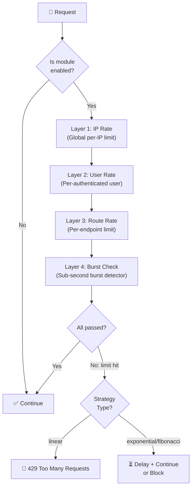
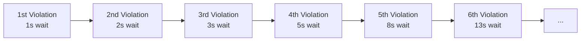

# ⏱️ Adaptive Rate Limiting

CyberShield's rate limiting goes far beyond simple request counting. It adapts to the client's behavior, uses intelligent backoff strategies, and protects resources granularly at every level.

---

## Rate Limiting Architecture



---

## The Three Strategies

### 1. Linear (Fixed Throttle)
A simple counter: requests allowed = limit. Once exceeded, all requests fail until the window resets.

```
Window: 60 seconds, Limit: 10 requests

Req 1-10:  ✅ Allowed
Req 11:    🚫 429 Too Many Requests (until window resets)
Req 12-N:  🚫 429 Too Many Requests
60s later: Window resets → Req 1-10 allowed again
```

**Best for**: Standard API rate limiting, RSS feeds, general endpoints.

### 2. Exponential Backoff
The allowed delay grows exponentially (×2) with each violation. The harshest of the three.

```
Attempt 1: Allowed (within limit)
Attempt 2: 1s delay
Attempt 3: 2s delay
Attempt 4: 4s delay
Attempt 5: 8s delay
...
Attempt N: 2^(N-1)s delay → effectively unusable within minutes
```

**Best for**: Password reset routes, OTP generation, registration forms where bot signup must be made economically infeasible.

### 3. Fibonacci Backoff
The delay follows the Fibonacci sequence. Less aggressive than exponential at first, but surpasses linear quickly. Natural-feeling for humans, infeasible for bots.



**Best for**: Login forms, 2FA verification, forgot-password. Makes brute force economically infeasible while a legitimate user who forgot their password can still retry.

---

## Multi-Layer Throttling

CyberShield applies up to four independent layers simultaneously:

| Layer | Key | Strategy | Example Limit |
|-------|-----|----------|--------------|
| **IP Rate** | `ip:{ip_address}` | Configurable | 60 req/60s |
| **User Rate** | `user:{user_id}` | Configurable | 1000 req/hour |
| **Route Rate** | `route:{md5(path)}` | Configurable | 20 req/60s |
| **Burst Rate** | `burst:{ip}:{10s_window}` | Token Bucket | 20 req/10s |

A request is blocked if **any** layer is exceeded.

---

## Configuration Reference

```php
// config/cybershield.php
'rate_limiting' => [
    'enabled' => env('CYBERSHIELD_RATE_LIMITING_ENABLED', true),
    'driver'  => env('CYBERSHIELD_RATE_LIMIT_DRIVER', 'cache'),  // 'cache' or 'redis'

    // ─── Global IP Limit (applies to all requests) ──────────────────────────
    'ip_limit_details' => [
        'limit'    => 60,
        'window'   => 60,          // 60 requests per 60 seconds
        'strategy' => 'linear',
        'message'  => 'Too many requests. Please slow down.',
    ],

    // ─── Login Route ─────────────────────────────────────────────────────────
    'login' => [
        'limit'    => 5,
        'window'   => 300,         // 5 attempts per 5 minutes
        'strategy' => 'fibonacci', // 1s, 2s, 3s, 5s, 8s... between violations
        'message'  => 'Too many login attempts. Your access is temporarily restricted.',
    ],

    // ─── Registration Route ──────────────────────────────────────────────────
    'registration' => [
        'limit'    => 3,
        'window'   => 3600,        // 3 signups per hour per IP
        'strategy' => 'exponential',
        'message'  => 'Too many registration attempts from this IP.',
    ],

    // ─── API Endpoints ───────────────────────────────────────────────────────
    'api' => [
        'limit'    => 1000,
        'window'   => 3600,        // 1000 calls per hour
        'strategy' => 'linear',
    ],
],
```

### Redis Configuration (Recommended for Production)

```env
CYBERSHIELD_RATE_LIMIT_DRIVER=redis
REDIS_HOST=127.0.0.1
REDIS_PORT=6379
```

Using Redis enables:
- **Atomic increments** — prevents race conditions in concurrent environments
- **Distributed sync** — multiple app instances share the same counters
- **Sub-millisecond reads** — negligible performance impact

---

## Applying Rate Limiters to Routes

### Using Middleware Aliases
```php
// routes/api.php

// Standard API throttling
Route::middleware('cybershield.api_rate_limiter')
    ->get('/products', [ProductController::class, 'index']);

// Cost-based limiting (budget per api key)
Route::middleware(['cybershield.api_rate_limiter', 'cybershield.cost_based_rate_limiter'])
    ->post('/reports/generate', [ReportController::class, 'create']);

// Multi-layer for login
Route::middleware([
    'cybershield.login_rate_limiter',      // 5 attempts / 5 min, fibonacci
    'cybershield.burst_rate_limiter',      // No sub-second bursts
    'cybershield.detect_brute_force_attack',
])->post('/login', [AuthController::class, 'store']);
```

### Programmatic Rate Limiting in Controllers
```php
use Illuminate\Support\Facades\RateLimiter;

public function generateOtp(Request $request): JsonResponse
{
    $key = 'otp:' . real_ip() . ':' . $request->email;

    if (RateLimiter::tooManyAttempts($key, maxAttempts: 3)) {
        $seconds = RateLimiter::availableIn($key);
        return response()->json([
            'message' => "Too many OTP requests. Try again in {$seconds} seconds."
        ], 429);
    }

    RateLimiter::hit($key, decaySeconds: 300); // 5 minute window

    // Send OTP...
    return response()->json(['message' => 'OTP sent.']);
}
```

---

## Real-World Use Cases

### 1. Preventing Login Brute Force
```
Target: POST /login
Attack: Bot tries 10,000 passwords in 10 minutes.

CyberShield setup:
  middleware: 'cybershield.login_rate_limiter'
  config: limit=5, window=300, strategy=fibonacci

Timeline:
  Attempt 1-5: Allowed (window: 5 minutes)
  Attempt 6:   1s mandatory wait (fibonacci: 1)
  Attempt 7:   2s mandatory wait (fibonacci: 2)
  Attempt 8:   3s mandatory wait (fibonacci: 3)
  Attempt 10:  8s mandatory wait (fibonacci: 8)
  Attempt 15:  55s mandatory wait (fibonacci: 55)

Result: 10,000 attempts would take hours → attack abandoned.
```

### 2. Preventing Heavy Export Database Overload
```
Target: GET /api/v1/export?format=csv
Attack: User triggers heavy export 20 times in 30 seconds.

CyberShield setup:
  middleware: 'cybershield.endpoint_rate_limiter'
  Custom config: limit=3, window=60

Result: After 3 exports, user is throttled for 60s.
        The rest of the site remains fast and unaffected.
```

### 3. API Quota Management
```
API Plan: Starter = 100 credits/day
Heavy endpoint: POST /ai/generate = 10 credits each

CyberShield setup:
  middleware: 'cybershield.cost_based_rate_limiter'
  endpoint_costs: {'api/ai/generate': 10}
  daily_cost_limit: 100

Result: After 10 AI calls (10 credits × 10 = 100), 
        the API key's daily quota is exhausted → 429.
```

### 4. Distributed Rate Limiting (Multi-Server)
```
Problem: 3 app servers, each with their own rate limiter → limit is bypassed.
Solution: Redis-backed distributed limiter.

middleware: 'cybershield.distributed_rate_limiter'
CYBERSHIELD_RATE_LIMIT_DRIVER=redis

All 3 servers share the same Redis counter → true distributed limiting.
```

[← Back to Bot Protection](bot-protection.md) | [Next: API Security →](api-security.md)
