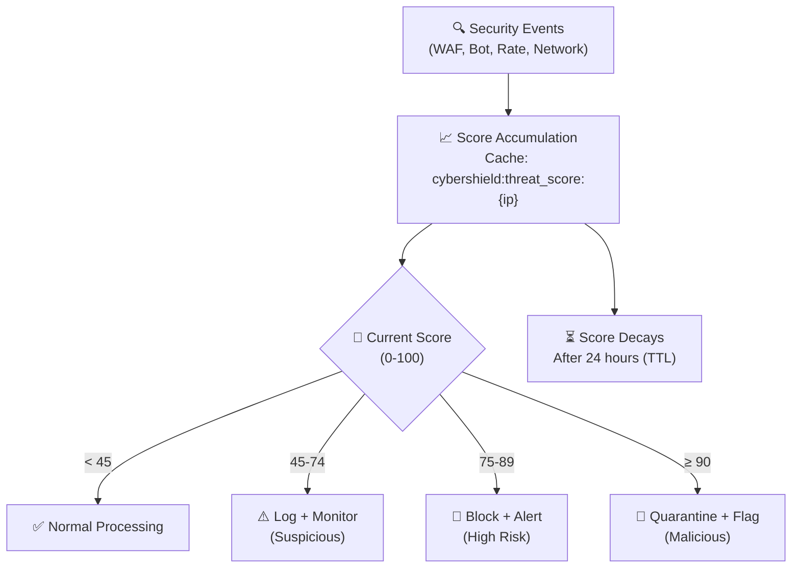

# 🕵️ Threat Intelligence Engine

The CyberShield Threat Intelligence Engine is the central nervous system of the entire security stack. It aggregates signals from every other module, maintains real-time IP risk scores, and orchestrates automated responses to detected threats.

---

## 🧠 How the Scoring Works



### Threat Score Events & Points

| Security Event | Points | Trigger |
|---------------|--------|---------|
| Insecure request (no HTTPS) | +10 | `cybershield.validate_request_protocol` |
| Missing `Accept-Language` header | +20 | Bot signal — header check |
| Suspicious User-Agent | +30 | Attack tool UA detected |
| WAF match — low severity | +20 | `detect_sql_injection` (low pattern) |
| WAF match — medium severity | +35 | XSS, path traversal |
| WAF match — high severity | +60 | SQL injection, RCE |
| Rate limit exceeded | +15 | Any rate limiter |
| Bot honeypot triggered | +50 | `detect_form_submission_bot` |
| Blocked country access | +25 | Geo restriction |
| TOR network detected | +40 | `detect_tor_network` |
| Session hijack detected | +55 | `enforce_session_security` |

All scores are **additive** and accumulated for the IP address. The score persists in cache for 24 hours (`score_ttl: 86400`), then resets.

---

## 🛡️ Reputation System

| Score Range | Reputation | `ip_reputation()` | Behavior |
|------------|------------|-------------------|---------|
| 0 – 14 | Safe | `"Trusted"` | Normal processing |
| 15 – 44 | Normal | `"Neutral"` | Normal processing |
| 45 – 74 | Suspicious | `"Suspicious"` | Logged, increased scrutiny |
| 75 – 89 | High Risk | `"Malicious"` | Blocked (if above threshold) |
| 90 – 100 | Malicious | `"Malicious"` | Quarantined + flagged |

---

## 🚫 Automatic IP Quarantine

When an IP's threat score exceeds the `threat_score_threshold` (default: 80), CyberShield automatically quarantines it.

### Quarantine Mechanism
```
1. IP makes request → WAF detects high-severity SQLi → +60 points
2. Total score: 65 → "Suspicious" → logged
3. IP makes another request → Rate limit exceeded → +15 points
4. Total score: 80 → Equals threshold → QUARANTINE triggered
5. Cache key set: cybershield:blocked:{ip} = "Auto-blocked: threshold reached"
6. TTL: 7 days (high severity block)
7. All future requests from this IP: instant 403 (< 1ms — cache lookup only)
```

### Block Duration by Severity

| Trigger Severity | Block Duration | Use Case |
|-----------------|---------------|---------|
| `low` | 1 day | Probing behavior |
| `medium` | 3 days | Suspicious patterns |
| `high` | 7 days | Active attack attempt |
| `critical` | 30 days | Confirmed malicious activity |

```php
// config/cybershield.php
'firewall' => [
    'blocking_ttl' => [
        'low'      => 1,
        'medium'   => 3,
        'high'     => 7,
        'critical' => 30,
    ],
],
'network_security' => [
    'threat_score_threshold' => 80,  // Auto-block threshold
],
```

---

## 🔧 Manual Threat Management

```php
// Controller or Admin Panel

// View current threat score
$score = ip_threat_score('203.0.113.45');
// Returns: 73 (integer 0-100)

// Get reputation label
$rep = ip_reputation('203.0.113.45');
// Returns: "Suspicious"

// Is high risk?
$isRisky = is_high_risk('203.0.113.45');
// Returns: true (if score >= 75)

// Manual block for a specific IP
Cache::put('cybershield:blocked:203.0.113.45', 'Manual ban: abuse report', now()->addDays(30));

// Or block the current request's IP
block_current_ip('Fraudulent transaction detected');

// Unblock an IP
Cache::forget('cybershield:blocked:203.0.113.45');
whitelist_current_ip();

// Check block status
$isBlocked = ip_is_blacklisted('203.0.113.45');

// Get request velocity (requests in current window)
$velocity = get_ip_velocity('203.0.113.45');
// Returns: 347 (requests in last window)

// Check if global attack mode is active
$underAttack = is_threat_active();
// Returns: true (if Cache::has('cybershield:global_attack_mode'))

// Activate global attack mode (triggers all @secureAttackDetected directives)
Cache::put('cybershield:global_attack_mode', true, now()->addHours(2));
```

---

## 📊 Threat Detection Configuration

```php
// config/cybershield.php
'threat_detection' => [
    'log_threats'      => true,    // Write all threats to security_logs table
    'block_on_threat'  => true,    // Actually block in 'active' mode
    'sql_injection'    => true,    // Enable SQLi detection module
    'xss_attack'       => true,    // Enable XSS detection module
    'rce_attack'       => true,    // Enable RCE detection module
    'traversal_attack' => true,    // Enable path traversal detection

    // Points to add per event type (used to build up IP score)
    'scoring' => [
        'insecure_request'        => 10,
        'missing_accept_language' => 20,
        'suspicious_user_agent'   => 30,
    ],

    // How long threat scores persist before resetting (24 hours)
    'score_ttl' => 86400,
],
```

---

## 🌍 Real-World Scenario: DDoS Mitigation

```
Attack: 500 IPs from a botnet hammer /api/v1/login with credential stuffing.

CyberShield Response Timeline:
T+0s:  First wave — 50 IPs detected, bot UA strings → +30 pts each
T+1s:  Rate limiter triggers on all 50 → +15 pts each = 45 pts total
T+2s:  WAF detects SQLi in some payloads → +60 pts → score = 105 → block + quarantine
T+3s:  Honeypot triggers on form-filling bots → +50 pts → immediate block
T+5s:  Next wave — 200 new IPs
T+6s:  Global velocity spike detected → Cache::put('global_attack_mode', true)
T+6s:  @secureAttackDetected banner shows on all pages
T+6s:  All rate limits tighten (adaptive limiter responds to attack mode)
T+60s: Attack IPs all quarantined or throttled
T+90s: Attack traffic reduced by 94%
```

---

## 🔗 Integration with Blade Directives

```blade
{{-- Show progressive threat warnings in your UI --}}

@secureThreatLow
    <div class="alert-yellow text-sm">
        Unusual activity noted on your account.
    </div>
@endsecureThreatLow

@secureThreatHigh
    <div class="alert-red">
        ⚠️ Your account shows high-risk signals. 
        <a href="/security/verify">Verify your identity</a>
    </div>
@endsecureThreatHigh

@secureAttackDetected
    <div class="site-lockdown-banner">
        🚨 We are currently experiencing elevated security activity.
        Features have been temporarily restricted.
    </div>
@endsecureAttackDetected

@secureThreatCritical
    <div class="modal-overlay">
        Your access has been suspended pending security review.
        <a href="/support">Contact Support</a>
    </div>
@endsecureThreatCritical
```

[← Back to Networking](networking.md) | [Next: Project Scanning →](project-scanning.md)
